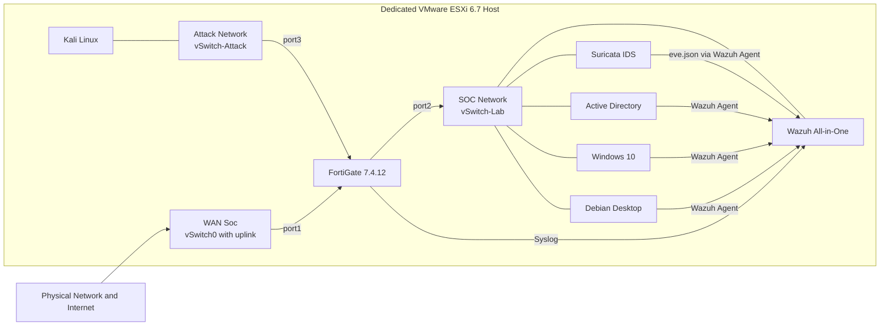

# SOC Home Lab: End-to-End Security Monitoring with Wazuh, Suricata, and FortiGate

A small Security Operations Center built from scratch on a dedicated VMware ESXi host. The lab combines firewall, network, identity, and endpoint telemetry into a single monitoring workflow — and documents every decision, limitation, and test result along the way.

**Current stage:** Chapter 2 – Endpoint and Detection Engineering. Milestone-level status lives in the [Roadmap](./ROADMAP.md).

## Why I built this

I come from NOC and cloud operations, where networking, infrastructure monitoring, virtualization, and troubleshooting were my day-to-day. This lab is how I point that experience at security operations: instead of just studying detection concepts, I build the monitoring pipeline myself and investigate what comes out of it.

It's my first structured SOC project, so the scope is deliberately small. Nothing gets added until what's already running is understood, tested, and documented.

## What the lab does

The core workflow, end to end:

1. Kali Linux generates controlled test activity from an isolated network.
2. FortiGate routes, filters, and logs the traffic between the Attack and SOC networks.
3. Suricata watches the monitored segment passively, while the endpoints produce system and identity telemetry.
4. Wazuh centralizes everything — it's where the investigation happens.
5. Each test scenario ends with reviewed evidence and a written investigation report.

Chapter 1 validates this workflow through two scenarios: network discovery from Kali (UC-01) and repeated authentication failures against Active Directory (UC-02). Their full definitions, required evidence, and acceptance criteria are in the [Chapter 1 Scope](./docs/00-project-scope.md).

## What this project demonstrates

Skills exercised across the lab, each backed by a document with evidence:

- **Network segmentation and firewall policy design** under a hard constraint — the evaluation license allows exactly three policies, and the design spends them deliberately.
- **SIEM deployment and telemetry pipelines** — agent enrollment, syslog ingestion, and file-based collection converging on a single Wazuh node.
- **Passive network monitoring** — IDS placement, capture interface design, and the virtual switch configuration that makes sniffing possible.
- **Evidence-based validation** — every milestone closes with controlled tests, expected-versus-observed results, and reviewed screenshots, not with "it's installed".
- **Virtualization and infrastructure operations** — ESXi networking, resource allocation, and the trade-offs of running a lab on one physical box.

## Architecture

The lab runs on a dedicated VMware ESXi 6.7 host: a 14-core Intel Xeon E5-2680 v4, 64 GB of RAM, an SSD, and a single physical network interface.

Only the external virtual switch has a physical uplink. The SOC and Attack networks are internal to the host, and the FortiGate is the only routed path between them.

Every path shown is a deployed and validated telemetry flow.



## Technology choices

| Technology | Role in the lab |
|---|---|
| VMware ESXi 6.7 | Dedicated hypervisor. Keeps the internal networks isolated at the virtual switch level. |
| FortiGate 7.4.12 (Evaluation) | Routing, segmentation, and policy enforcement between the networks. The evaluation license caps the lab at three firewall policies — a real constraint the design works around. |
| Wazuh all-in-one (Ubuntu Server 24.04) | The central SIEM. Receives agent, syslog, and Suricata telemetry, and is the single place where events are analyzed. |
| Suricata (Ubuntu Server 24.04) | Passive network IDS on the monitored segment, exporting structured events through `eve.json`. |
| Sysmon (Windows 10) | Process-level endpoint telemetry — command lines, hashes, and parent lineage feeding the detection work. |
| Active Directory + Windows 10 | Identity, authentication, and Windows endpoint telemetry. |
| Debian Desktop | Linux endpoint visibility. |
| Kali Linux | Source of controlled test traffic, kept inside the isolated Attack Network. |

## Design decisions worth a closer look

A few choices carry most of the lab's reasoning:

- **The Attack-to-SOC policy allows everything, on purpose.** This is a detection lab — attack traffic is supposed to cross the boundary and be seen, not stopped at the edge. NAT is disabled on that path so every log records the real source address. The [segmentation baseline](./docs/02-fortigate-segmentation.md) explains the trade-off.
- **Three firewall policies is all the license gives, and all three are spent.** Which paths earned a policy slot, and which rely on the implicit deny, is a design decision documented in the [same baseline](./docs/02-fortigate-segmentation.md).
- **The IDS captures on an interface with no IP address.** A promiscuous port group and a dedicated listen-only interface separate capture from management — the closest a virtual lab gets to a SPAN port. Details in the [sensor validation](./docs/05-suricata-sensor.md).
- **Kali is deliberately unmonitored.** The attack machine carries no agent, so its footprint in the SIEM is exactly what the defensive stack observes — nothing more. The reasoning is in the [agent onboarding](./docs/03-wazuh-agent-onboarding.md).

## Documentation

Each milestone produces one document, written as the work happens:

| Document | What it covers | Milestone |
|---|---|---|
| [Chapter 1 Scope](./docs/00-project-scope.md) | Boundaries, telemetry sources, validation scenarios, and acceptance criteria — the chapter's contract | C1-01 |
| [Infrastructure Baseline](./docs/01-infrastructure-baseline.md) | ESXi host, virtual networking, VM inventory, IP plan, and traffic paths | C1-02 |
| [FortiGate Segmentation Baseline](./docs/02-fortigate-segmentation.md) | Interfaces, firewall policies, expected traffic matrix, and the allow/deny tests that prove it | C1-03 |
| [Wazuh Agent Onboarding](./docs/03-wazuh-agent-onboarding.md) | Manager deployment, agent naming convention, enrollment, and verification | C1-04 |
| [FortiGate Telemetry Integration](./docs/04-fortigate-telemetry.md) | The syslog pipeline and the controlled event that validates decoding end to end | C1-05 |
| [Suricata Sensor Validation](./docs/05-suricata-sensor.md) | Capture design, sensor configuration, and the passive capture proof | C1-06 |
| [Suricata and Wazuh Integration](./docs/06-suricata-wazuh-integration.md) | Collecting `eve.json` through the host agent and the controlled alert that validates it | C1-07 |
| [UC-01: Network Discovery](./investigations/UC-01/report.md) | Investigation report — a controlled scan from Kali traced across FortiGate, Suricata, and Wazuh | C1-08 |
| [UC-02: Authentication Failures](./investigations/UC-02/report.md) | Investigation report — a controlled SMB brute force against Active Directory, from Windows event to Wazuh alert | C1-09 |
| [Chapter 1 Closure](./docs/07-chapter-1-closure.md) | Success-criteria review, consolidated versions and limitations, and lessons learned | C1-10 |
| [Chapter 2 Scope](./docs/08-chapter-2-scope.md) | What detection engineering must deliver, the workflow it validates, and what stays out | C2-01 |
| [Sysmon Deployment](./docs/09-sysmon-deployment.md) | Process-level telemetry on the Windows endpoint — configuration choice, collection, and the alerting gap it exposed | C2-02 |
| [Sysmon Telemetry Baseline](./docs/10-sysmon-baseline.md) | What the endpoint looks like when nothing is wrong — event distribution, a noisy updater, and an injection indicator investigated | C2-03 |
| [UC-03: Suspicious PowerShell Execution](./investigations/UC-03/report.md) | Investigation report — a controlled PowerShell download cradle, captured in Sysmon and traced to Wazuh, and the alerting gap it exposes | C2-04 |
| [Custom Detection Rule](./docs/11-custom-detection-rule.md) | The first custom Wazuh rule — a PowerShell download-cradle detection, why it was rebuilt on Script Block Logging, and how it was validated | C2-05 |
| [Project Roadmap](./ROADMAP.md) | Milestones, current focus, and status — the only place status lives | — |

## Repository structure

```
.
├── README.md            ← you are here
├── ROADMAP.md           ← milestone status
├── docs/
│   ├── 00-project-scope.md
│   ├── 01-infrastructure-baseline.md
│   ├── 02-fortigate-segmentation.md
│   ├── 03-wazuh-agent-onboarding.md
│   ├── 04-fortigate-telemetry.md
│   ├── 05-suricata-sensor.md
│   ├── 06-suricata-wazuh-integration.md
│   ├── 07-chapter-1-closure.md
│   ├── 08-chapter-2-scope.md
│   ├── 09-sysmon-deployment.md
│   ├── 10-sysmon-baseline.md
│   └── img/             ← sanitized evidence, one folder per document
└── investigations/     ← STAR investigation reports, one folder per scenario
    ├── UC-01/
    │   ├── report.md
    │   └── evidence/
    ├── UC-02/
    │   ├── report.md
    │   └── evidence/
    └── UC-03/
        ├── report.md
        └── evidence/
```

## Where the project is now

Chapter 1 is complete. The full telemetry pipeline is built and validated: every endpoint reports to Wazuh as an active agent, FortiGate logs arrive by syslog, and Suricata's `eve.json` reaches the SIEM through the host agent. Both investigation scenarios are done — network discovery in [UC-01](./investigations/UC-01/report.md) and a credential brute force in [UC-02](./investigations/UC-02/report.md), each traced from the attacker's action to the SIEM. The [Chapter 1 Closure](./docs/07-chapter-1-closure.md) reviews the success criteria and consolidates the versions, limitations, and lessons learned.

Chapter 2 is underway. Sysmon runs on the Windows endpoint with a documented configuration ([deployment](./docs/09-sysmon-deployment.md)), its normal behavior is measured and investigated ([baseline](./docs/10-sysmon-baseline.md)), and a controlled PowerShell attack has been captured and traced to the SIEM ([UC-03](./investigations/UC-03/report.md)). That scenario is decoded but not yet alerting — the next step is the custom rule that fires on it. Current focus and status live in the [Roadmap](./ROADMAP.md).

## What comes next

Chapter 2 continues with a custom Wazuh rule that alerts on the UC-03 activity, false-positive tuning against the measured baseline, and MITRE ATT&CK mapping. A later chapter will look at small, reversible response and automation workflows.

## Safety and ethical boundaries

Every test targets systems owned by the lab, inside the isolated environment. Nothing faces the internet, no third-party systems are touched, and no real malware is used. Anything published — screenshots, configurations, events, log samples — is reviewed first to remove credentials, personal data, and unnecessary infrastructure details.

## Connect

- [GitHub](https://github.com/guilhermeescame)
- [LinkedIn](https://www.linkedin.com/in/guilherme-barbirato-escame-053bb6293/)
