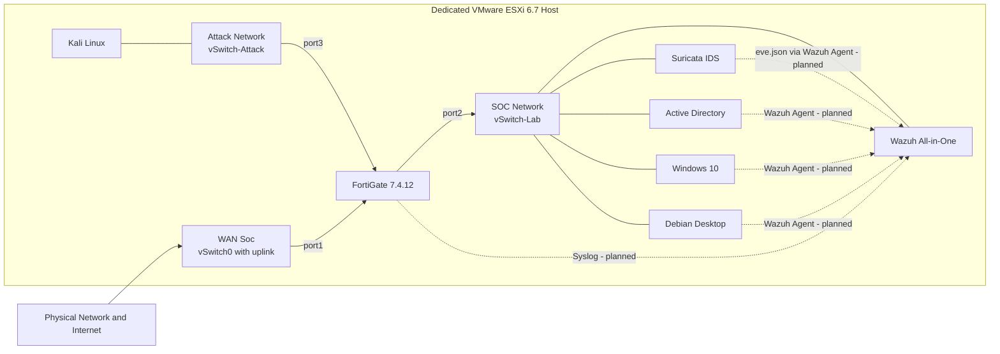

# SOC Home Lab: End-to-End Security Monitoring with Wazuh, Suricata, and FortiGate

A small Security Operations Center built from scratch on a dedicated VMware ESXi host. The lab combines firewall, network, identity, and endpoint telemetry into a single monitoring workflow — and documents every decision, limitation, and test result along the way.

**Current stage:** Chapter 1 – Core SOC Visibility, working on the infrastructure baseline. Detailed status lives in the [Roadmap](./ROADMAP.md).

## Why I built this

I come from NOC and cloud operations, where networking, infrastructure monitoring, virtualization, and troubleshooting were my day-to-day. This lab is how I point that experience at security operations: instead of just studying detection concepts, I build the monitoring pipeline myself and investigate what comes out of it.

It's my first structured SOC project, so the scope is deliberately small. Nothing gets added until what's already running is understood, tested, and documented.

## What the lab does

The core workflow, end to end:

1. Kali Linux generates controlled test activity from an isolated network.
2. FortiGate routes, filters, and logs the traffic between the Attack and SOC networks.
3. Suricata watches the monitored segment passively, while the endpoints produce system and identity telemetry.
4. Wazuh centralizes everything — it's where the investigation happens.
5. Each test scenario ends with reviewed evidence and a written investigation report.

Chapter 1 validates this workflow through two scenarios: network discovery from Kali (UC-01) and repeated authentication failures against Active Directory (UC-02). Their full definitions, required evidence, and acceptance criteria are in the [Chapter 1 Scope](./docs/00-project-scope.md).

## Architecture

The lab runs on a dedicated VMware ESXi 6.7 host: a 14-core Intel Xeon E5-2680 v4, 64 GB of RAM, an SSD, and a single physical network interface.

Only the external virtual switch has a physical uplink. The SOC and Attack networks are internal to the host, and the FortiGate is the only routed path between them.

Solid lines in the diagram are deployed network paths. Dashed lines are telemetry integrations planned for Chapter 1 but not yet validated.

## Technology choices

| Technology | Role in the lab |
|---|---|
| VMware ESXi 6.7 | Dedicated hypervisor. Keeps the internal networks isolated at the virtual switch level. |
| FortiGate 7.4.12 (Evaluation) | Routing, segmentation, and policy enforcement between the networks. The evaluation license caps the lab at three firewall policies — a real constraint the design works around. |
| Wazuh all-in-one (Ubuntu Server 24.04) | The central SIEM. Receives agent, syslog, and Suricata telemetry, and is the single place where events are analyzed. |
| Suricata (Ubuntu Server 24.04) | Passive network IDS on the monitored segment, exporting structured events through `eve.json`. |
| Active Directory + Windows 10 | Identity, authentication, and Windows endpoint telemetry. |
| Debian Desktop | Linux endpoint visibility. |
| Kali Linux | Source of controlled test traffic, kept inside the isolated Attack Network. |

## Where the project is now

All virtual machines and networks are deployed and operational. The current work is documenting the infrastructure baseline and configuring the Suricata capture interface. Next up: Wazuh Agent onboarding, FortiGate syslog ingestion, Suricata integration, and the two validation scenarios.

Deployed is not the same as validated — each milestone only closes after documented testing and evidence review. Milestone-level status is tracked in the [Roadmap](./ROADMAP.md).

## What comes next

Once the core monitoring workflow is validated, the project moves into endpoint and detection engineering: Sysmon, custom Wazuh rules, false-positive analysis, and MITRE ATT&CK mapping. A later chapter will look at small, reversible response and automation workflows.

None of that starts before Chapter 1 closes.

## Safety and ethical boundaries

Every test targets systems owned by the lab, inside the isolated environment. Nothing faces the internet, no third-party systems are touched, and no real malware is used. Anything published — screenshots, configurations, events, log samples — is reviewed first to remove credentials, personal data, and unnecessary infrastructure details.

## Documentation

- [Chapter 1 Scope](./docs/00-project-scope.md) — boundaries, telemetry sources, acceptance criteria, and technical constraints.
- [Project Roadmap](./ROADMAP.md) — milestones, current focus, and status.

## Connect

- [GitHub](https://github.com/guilhermeescame)
- [LinkedIn](https://www.linkedin.com/in/guilherme-barbirato-escame-053bb6293/)
