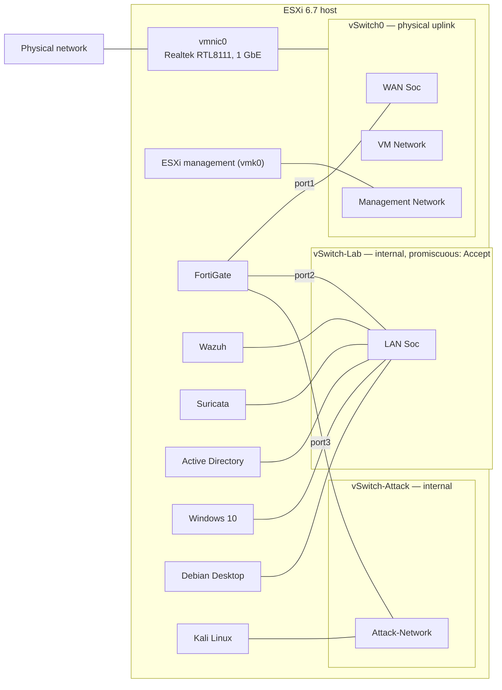

# Infrastructure Baseline

The reference for everything the lab runs on: host resources, virtual networking, VM inventory, IP plan, and the traffic paths between networks. This is the deliverable of milestone C1-02 and the foundation for the FortiGate, Suricata, and integration work that follows.

Chapter context and boundaries are in the [Chapter 1 Scope](./00-project-scope.md); status is tracked in the [Roadmap](../ROADMAP.md).

## ESXi host

| Component | Value |
|---|---|
| Hypervisor | VMware ESXi 6.7.0 (build 20191204001, customized image) |
| CPU | Intel Xeon E5-2680 v4, 14 cores |
| Memory | 64 GB |
| Storage | 1 TB SSD (`datastore1`) |
| Physical NIC | `vmnic0` — Realtek RTL8111, 1 GbE, `r8168` driver |

The ESXi image is customized because the onboard Realtek RTL8111 has no driver in the stock distribution — the community `r8168` driver is bundled in. ESXi 6.7 is also past end of support. The host is isolated from the internet, so the lab accepts both risks; they are tracked under known limitations below.

## Virtual networking

Only `vSwitch0` has a physical uplink. The SOC and Attack networks exist only inside the host, which makes the FortiGate the single routed path between them.

| vSwitch | Physical uplink | Port group(s) | Promiscuous mode | Forged transmits | Purpose |
|---|---|---|---|---|---|
| vSwitch0 | Yes (`vmnic0`) | WAN Soc, VM Network, Management Network | Reject (default) | Reject (default) | External connectivity for the FortiGate WAN and ESXi management |
| vSwitch-Lab | No | LAN Soc | **Accept** | Reject (default) | SOC Network |
| vSwitch-Attack | No | Attack-Network | Reject (default) | Reject (default) | Attack Network |

Promiscuous mode on `vSwitch-Lab` is what makes Suricata's passive capture possible (C1-06): with it accepted, an interface in the `LAN Soc` port group can see traffic addressed to the other SOC hosts. Forged transmits stays at the default, since a passive sensor does not transmit on its capture interface.

The diagram below shows the topology as configured in ESXi — port groups included. The screenshot listed under [Evidence](#evidence) documents the same view straight from the Host Client.

## VM inventory

| VM | Name in ESXi | Operating system | vCPU | RAM (GB) | Disk (GB) | Network(s) | Role |
|---|---|---|---|---|---|---|---|
| FortiGate | `FortiGate` | FortiOS 7.4.12 (Evaluation) | 1 | 2 | 32 | vSwitch0 (port1), vSwitch-Lab (port2), vSwitch-Attack (port3) | Routing, segmentation, and policy enforcement |
| Wazuh | `SOC-SERVER` | Ubuntu Server 24.04 | 4 | 8 | 60 | vSwitch-Lab | Central SIEM (all-in-one) |
| Suricata | `SOC-NIDS` | Ubuntu Server 24.04 | 2 | 4 | 40 | vSwitch-Lab <!-- TODO: dedicated capture interface, defined in C1-06 --> | Passive network IDS |
| Active Directory | `SOC_AD` | Windows Server 2022 | 8 | 8 | 60 | vSwitch-Lab | Domain controller, identity telemetry |
| Windows 10 | `SOC_WIN10` | Windows 10 Pro | 4 | 8 | 60 | vSwitch-Lab | Domain-joined Windows endpoint |
| Debian Desktop | `SOC_DEBIAN` | Debian 13.5 | 2 | 4 | 30 | vSwitch-Lab | Linux endpoint |
| Kali Linux | `Kali` | Kali 2026.2 | 4 | 8 | 50 | vSwitch-Attack | Source of controlled test traffic |

The allocation totals 25 vCPU and 42 GB of RAM against 14 physical cores and 64 GB. The CPU overcommit has not been a problem in practice: the VMs are rarely busy at the same time.

## IP plan

| Network | Subnet | Gateway (FortiGate) | Notes |
|---|---|---|---|
| WAN / physical | 192.168.16.0/24 | 192.168.16.1 (physical router) | FortiGate port1 addressed by DHCP |
| SOC Network | 10.10.10.0/24 | 10.10.10.1 (port2) | |
| Attack Network | 10.10.20.0/24 | 10.10.20.1 (port3) | |

| Host | IP address | Network |
|---|---|---|
| FortiGate port1 (WAN) | 192.168.16.244 | WAN / physical |
| FortiGate port2 | 10.10.10.1 | SOC Network |
| FortiGate port3 | 10.10.20.1 | Attack Network |
| Wazuh | 10.10.10.10 | SOC Network |
| Suricata (management) | 10.10.10.15 | SOC Network |
| Active Directory | 10.10.10.20 | SOC Network |
| Windows 10 | 10.10.10.30 | SOC Network |
| Debian Desktop | 10.10.10.40 | SOC Network |
| Kali Linux | 10.10.20.10 | Attack Network |

## Traffic paths

1. **Attack → SOC:** Kali (vSwitch-Attack) → FortiGate port3 → firewall policy evaluation → FortiGate port2 → SOC Network. Every validation scenario exercises this path.
2. **SOC → external:** SOC hosts reach the internet through port2 → port1 under the `SOC-to-Internet` policy, an egress-only rule. There is no inbound path from the WAN to the SOC Network.
3. **Management:** the ESXi Host Client (192.168.16.227) and the FortiGate web interface (192.168.16.244) are reached from the physical network only.

Traffic the FortiGate denies never reaches the SOC Network, so it appears only in FortiGate logs — Suricata sees the monitored segment, not the firewall's ingress.

## Known limitations

- External connectivity, management, and lab traffic share the single physical NIC; there is no out-of-band management path.
- The Realtek RTL8111 depends on a community driver in a customized ESXi image — an unsupported configuration.
- ESXi 6.7 no longer receives security updates.
- The FortiGate Evaluation license allows three firewall policies, and `SOC-to-Internet` already occupies one of them.
- The Suricata VM still has a single interface on `LAN Soc`; the dedicated capture layout is defined in C1-06.

## Evidence

Screenshots supporting this baseline, sanitized before publication:

| File | What it shows |
|---|---|
| `img/01-baseline/esxi-network-topology.png` | vSwitches, port groups, and physical uplink |
| `img/01-baseline/esxi-vm-inventory.png` | VM list with resource allocation |
