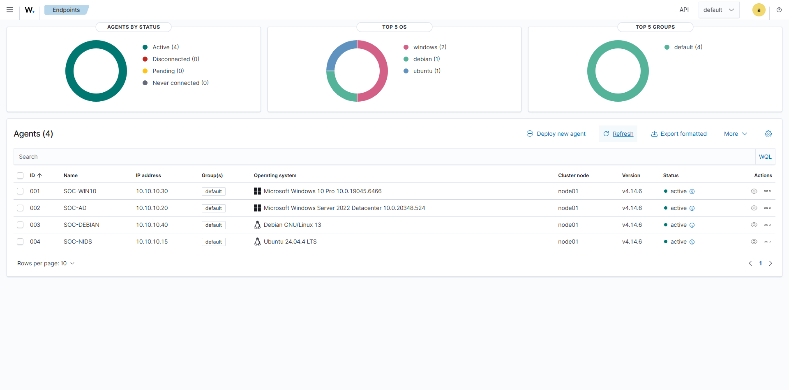

# Wazuh Agent Onboarding

How each monitored system was enrolled in Wazuh and how the deployment was verified. This is the deliverable of milestone C1-04: Active Directory, Windows 10, Debian, and the Suricata host reporting as active agents, each correctly identified.

The network paths the agents depend on are documented in the [Infrastructure Baseline](./01-infrastructure-baseline.md) and the [FortiGate Segmentation Baseline](./02-fortigate-segmentation.md); status is tracked in the [Roadmap](../ROADMAP.md).

## Manager

| Item | Value |
|---|---|
| Deployment | Wazuh all-in-one (manager, indexer, dashboard) on `SOC-SERVER` |
| Version | 4.14.6 |
| Address | 10.10.10.10 (SOC Network) |
| Hostname | `wazuh-server` |
| Agent communication | Default ports — 1514/TCP (events), 1515/TCP (enrollment) |

All agents and the manager share the SOC Network, so agent traffic never crosses the FortiGate — no firewall policy was needed for enrollment.

## Naming convention

Agents are named after their role in the lab, not after the machine's hostname. Hostnames stay untouched — renaming a domain controller is risky and renaming the rest buys nothing — so the agent name assigned at enrollment is what appears in the dashboard and in the evidence.

| Agent name | VM | Hostname | IP | Operating system | Install method |
|---|---|---|---|---|---|
| SOC-AD | Active Directory | `ADSERVER` | 10.10.10.20 | Windows Server 2022 Datacenter | MSI package |
| SOC-WIN10 | Windows 10 | `DESKTOP-CAG70U6` | 10.10.10.30 | Windows 10 Pro | MSI package |
| SOC-DEBIAN | Debian Desktop | `debian` | 10.10.10.40 | Debian 13.5 | `.deb` package |
| SOC-NIDS | Suricata | `soc-suricata` | 10.10.10.15 | Ubuntu Server 24.04 | `.deb` package |

Kali is deliberately not enrolled: the attack machine stays unmonitored so its telemetry footprint comes only from what the defensive stack observes. The FortiGate is not an agent either — its logs arrive by syslog, which is the subject of C1-05.

## Enrollment

All four agents run version 4.14.6, matching the manager. The agent name and manager address are passed at install time, which is the whole trick behind the naming convention.

On the Windows hosts (SOC-AD, SOC-WIN10):

```
Invoke-WebRequest -Uri https://packages.wazuh.com/4.x/windows/wazuh-agent-4.14.6-1.msi -OutFile $env:tmp\wazuh-agent; msiexec.exe /i $env:tmp\wazuh-agent /q WAZUH_MANAGER='10.10.10.10' WAZUH_AGENT_NAME='SOC-AD'
```

On the Linux hosts (SOC-DEBIAN, SOC-NIDS):

```
wget https://packages.wazuh.com/4.x/apt/pool/main/w/wazuh-agent/wazuh-agent_4.14.6-1_amd64.deb
sudo WAZUH_MANAGER='10.10.10.10' WAZUH_AGENT_NAME='SOC-DEBIAN' dpkg -i ./wazuh-agent_4.14.6-1_amd64.deb
```

Enrollment completed without issues on all four systems.

## Verification

An agent counts as onboarded when the dashboard shows it **Active**, with the expected name, IP, and operating system — and the manager receives its events.

The dashboard confirms all four: SOC-WIN10, SOC-AD, SOC-DEBIAN, and SOC-NIDS report as active, each with the IP defined in the baseline and the operating system correctly detected (including the exact build for the Windows hosts). No agent required re-enrollment or manual fixes.


*The Endpoints view with the four agents active, named by the lab convention.*

## Evidence

| File | What it shows |
|---|---|
| `img/03-wazuh/agents-active.png` | The four agents reporting as Active with the expected names, IPs, and operating systems |
