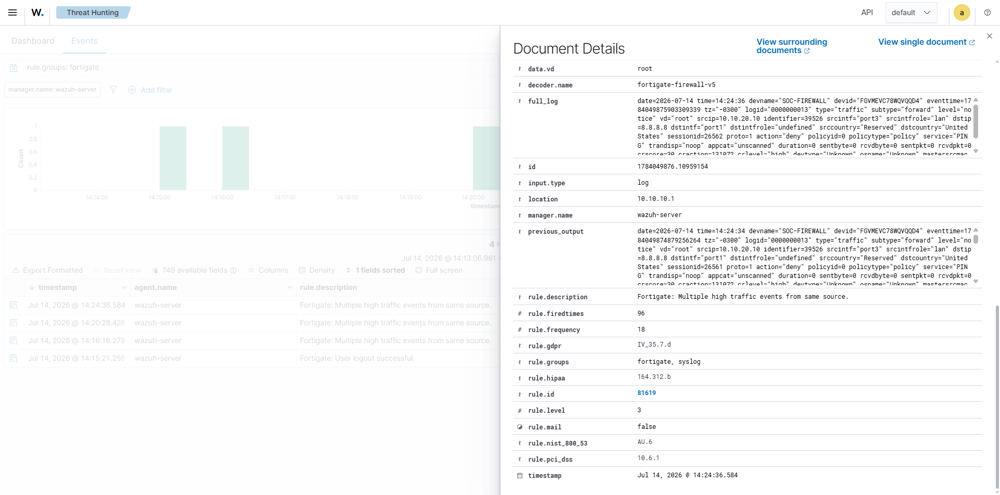

# FortiGate Telemetry Integration

How the FortiGate's logs reach Wazuh and how the integration was verified. This is the deliverable of milestone C1-05: firewall events received by syslog, identified by the FortiGate decoders, and available for investigation in the dashboard.

The firewall configuration being shipped here is documented in the [FortiGate Segmentation Baseline](./02-fortigate-segmentation.md); the Wazuh deployment receiving it, in the [Wazuh Agent Onboarding](./03-wazuh-agent-onboarding.md). Status is tracked in the [Roadmap](../ROADMAP.md).

## How it works

The FortiGate has no Wazuh agent — it ships logs by syslog. The path is short: the firewall sends its traffic and system logs to the Wazuh manager on the SOC Network, and the manager's built-in FortiGate decoders parse each message into fields (action, source, destination, policy) that investigations can filter on.

Because the FortiGate reaches 10.10.10.10 through its own port2 interface, the syslog packets arrive with source 10.10.10.1 — the address the Wazuh side must allow.

## FortiGate configuration

Configured through the CLI:

```
config log syslogd setting
    set status enable
    set server "10.10.10.10"
    set mode udp
    set port 514
end
```

Log format and forwarded categories stay at the defaults, which include the traffic and system logs the lab needs.

## Wazuh configuration

A second `<remote>` block in `/var/ossec/etc/ossec.conf` — separate from the agents' `secure` listener, which stays untouched:

```xml
<remote>
  <connection>syslog</connection>
  <port>514</port>
  <protocol>udp</protocol>
  <allowed-ips>10.10.10.1</allowed-ips>
</remote>
```

The manager restarted clean and the four agents stayed active.

## Verification

The integration counts as validated when a known, controlled event — not background noise — is generated at the firewall and found in Wazuh with the FortiGate decoder applied.

The controlled event was a repeated `ping 8.8.8.8` from Kali — traffic the implicit deny drops and logs, as established in the segmentation baseline.


*The expanded event in Wazuh: the `fortigate-firewall-v5` decoder applied, with the denied ping's source, destination, action, and policy parsed out of the raw log.*

| Check | Expected | Observed | Evidence |
|---|---|---|---|
| Syslog reception | Manager receives messages from 10.10.10.1 | Events arriving with `location: 10.10.10.1` | [wazuh-fortigate-event-detail.png](./img/04-syslog/wazuh-fortigate-event-detail.png) |
| Decoding | Events parsed by the FortiGate decoder, with action/source/destination/policy fields | `decoder.name: fortigate-firewall-v5`; full log carries `srcip=10.10.20.10`, `dstip=8.8.8.8`, `action=deny`, `policyid=0`, `service=PING` | [wazuh-fortigate-event-detail.png](./img/04-syslog/wazuh-fortigate-event-detail.png) |
| Controlled event | The denied ping from Kali appears in the dashboard as a FortiGate event | The repeated pings raised rule 81619 ("Multiple high traffic events from same source"), correlating the denies into one alert | [wazuh-fortigate-events.png](./img/04-syslog/wazuh-fortigate-events.png) |

Two details in the result are worth reading closely. The individual deny messages match a rule below the alert threshold, so what surfaces in the dashboard is the correlation rule that fires on repetition — the SIEM summarizing noise instead of echoing it. And `policyid=0` in the decoded event points back to the implicit deny documented in the [segmentation baseline](./02-fortigate-segmentation.md), closing the loop between the firewall's configuration and what the SIEM records.

## Known limitations

- Syslog over UDP has no delivery guarantee; a lost datagram is a lost event. Acceptable at lab scale, worth remembering when an expected event is missing.
- Individual denied-traffic events sit below the default alert threshold and only surface through correlation rules. Tuning per-event visibility is detection engineering work and stays out of this chapter.

## Evidence

Screenshots supporting this document, sanitized before publication:

| File | What it shows |
|---|---|
| `img/04-syslog/fortigate-syslog-config.png` | Syslog destination on the FortiGate. The `show` output omits values left at default — `mode udp` and `port 514` are defaults, not missing settings. |
| `img/04-syslog/wazuh-fortigate-events.png` | FortiGate events in Threat Hunting, filtered by `rule.groups: fortigate` |
| `img/04-syslog/wazuh-fortigate-event-detail.png` | The expanded event: FortiGate decoder applied and the denied ping's fields (source, destination, action, policy) |
