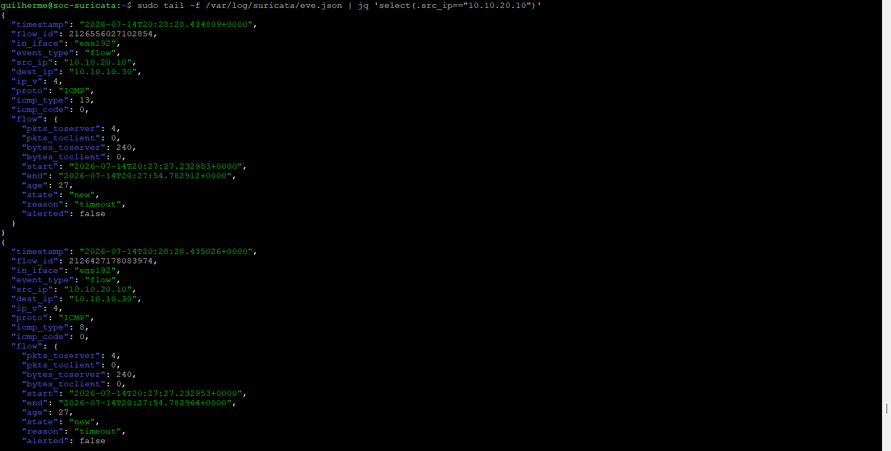

# Suricata Sensor Validation

How the Suricata host is turned into a passive network sensor and how its capture is verified. This is the deliverable of milestone C1-06: a dedicated capture interface watching the SOC segment, with Suricata recording controlled traffic in `eve.json`.

The virtual switch behavior this depends on is documented in the [Infrastructure Baseline](./01-infrastructure-baseline.md); forwarding `eve.json` into Wazuh is covered in the [Suricata and Wazuh Integration](./06-suricata-wazuh-integration.md). Status is tracked in the [Roadmap](../ROADMAP.md).

## Capture design

Passive network monitoring needs the sensor to see traffic that is not addressed to it. Two pieces make that work:

- **On the ESXi side**, the `LAN Soc` port group on `vSwitch-Lab` has promiscuous mode set to Accept, so any VM interface in that port group receives a copy of the segment's traffic. This is the setting recorded in the infrastructure baseline.
- **On the sensor**, a dedicated interface runs in that port group with no IP address, purely to listen. Management stays on the original interface (10.10.10.15), so administration and capture never share a NIC.

The result: `SOC-NIDS` keeps its management address on the first interface and sniffs the SOC segment on the second.

## Interfaces

| Interface | Purpose | Address | Notes |
|---|---|---|---|
| `ens160` | Management | 10.10.10.15 | SSH, Wazuh agent, updates |
| `ens192` | Capture | none | No IP; promiscuous; Suricata listens here |

Both interfaces sit in the same `LAN Soc` port group, so both receive a copy of the segment's traffic — that is how the promiscuous port group works. Suricata binds only to `ens192`; `ens160` keeps doing management and ignores what isn't addressed to it.

## Suricata configuration

Suricata 8.0.6, running as a systemd service in AF_PACKET mode. The settings that matter in `/etc/suricata/suricata.yaml`:

- `af-packet` capture interface set to `ens192`;
- `HOME_NET` set to `10.10.10.0/24`, so the SOC segment is treated as the network to protect;
- `eve-log` output enabled at the default path, `/var/log/suricata/eve.json`.

The service runs as the `suricata` user. Its control socket lives under `/run/suricata/`, created at boot by a small `tmpfiles.d` rule so the unprivileged service can open it — without it, Suricata starts but logs a socket-permission error and `suricatasc` cannot connect.

## Verification

The sensor counts as working when traffic between two *other* SOC hosts — not involving the sensor — shows up in `eve.json`. Traffic to the sensor's own management IP would prove nothing about passive capture.

The controlled test was traffic from Kali (10.10.20.10) to Windows 10 (10.10.10.30), crossing the Attack-to-SOC boundary. The sensor at 10.10.10.15 is nowhere in that path, so seeing the flow proves it is capturing passively rather than just its own traffic.

*`eve.json` on the sensor: a Kali-to-Windows 10 flow captured on `ens192`, with neither endpoint being the sensor itself.*

| Check | Expected | Observed | Evidence |
|---|---|---|---|
| Capture interface | Up, no IP, promiscuous | `ens192` UP with `PROMISC` set and no address | [capture-interface.png](./img/05-suricata/capture-interface.png) |
| Suricata running | Active, bound to the capture interface | Service active, running 8.0.6 with `--af-packet` on `ens192` | [suricata-status.png](./img/05-suricata/suricata-status.png) |
| Passive capture | `eve.json` records traffic between other hosts | Flow logged with `in_iface: ens192`, `src_ip: 10.10.20.10`, `dest_ip: 10.10.10.30` | [suricata-eve-events.png](./img/05-suricata/suricata-eve-events.png) |

## Known limitations

- Suricata sees only what reaches the monitored segment. Traffic the FortiGate denies before it crosses into the SOC Network never appears here — it lives only in the FortiGate logs, as noted in the segmentation baseline.
- A single promiscuous port group shows this sensor all SOC traffic; this mirrors a SPAN/monitor port and is enough for the lab, not a substitute for a hardware TAP.
- Because the port group is promiscuous, every VM in `LAN Soc` receives a copy of the segment's traffic, not just the sensor. Harmless in an isolated lab, but it means any SOC host could sniff the segment.

## Evidence

Screenshots supporting this document, sanitized before publication:

| File | What it shows |
|---|---|
| `img/05-suricata/capture-interface.png` | `ens192` up, no IP, PROMISC flag set |
| `img/05-suricata/suricata-status.png` | Suricata 8.0.6 active, bound to `ens192` in AF_PACKET mode |
| `img/05-suricata/suricata-eve-events.png` | `eve.json` recording the Kali-to-Windows flow the sensor is not part of |
