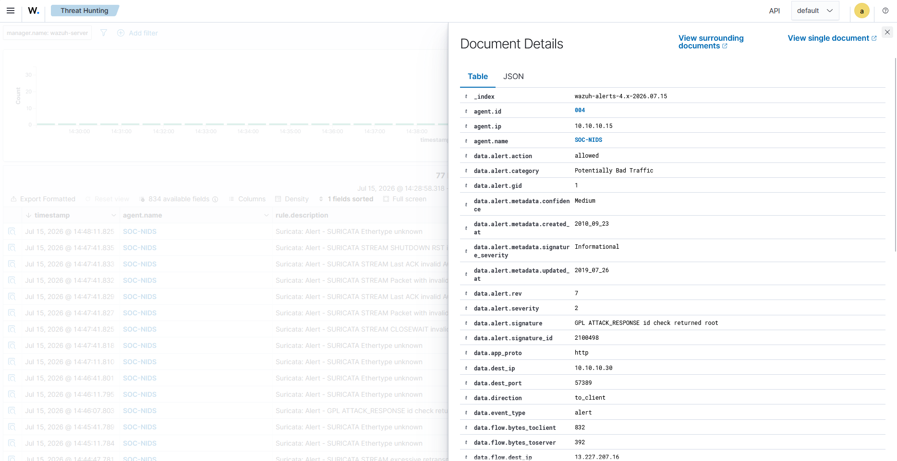

# Suricata and Wazuh Integration

How Suricata's `eve.json` becomes telemetry in Wazuh. This is the deliverable of milestone C1-07: the SOC-NIDS agent reading the sensor's output, the manager decoding it, and the expected Suricata events identified in the dashboard.

The sensor producing `eve.json` is documented in the [Suricata Sensor Validation](./05-suricata-sensor.md); the agent carrying it, in the [Wazuh Agent Onboarding](./03-wazuh-agent-onboarding.md). Status is tracked in the [Roadmap](../ROADMAP.md).

## How it works

The integration needs no new network path and no new component. The SOC-NIDS host already runs a Wazuh agent for its own system logs; this milestone points that agent at `/var/log/suricata/eve.json` as an additional log source. Because Suricata writes one JSON object per line, the agent forwards each event as structured data and the manager's JSON decoder takes it from there — Wazuh ships Suricata rules out of the box, so no custom decoding is involved.

## Sensor ruleset

Ingesting `eve.json` only proves transport. For Wazuh to raise a Suricata *alert*, the sensor needs detection rules loaded — flow and protocol events alone stay below the alert threshold.

The ruleset is ET Open, fetched with `suricata-update`, which consolidates everything into a single rule file. After a service restart, `suricata.log` confirms the load:

```
detect: 1 rule files processed. 52003 rules successfully loaded, 0 rules failed, 0 rules skipped
```

## Agent configuration

One `<localfile>` block added to `/var/ossec/etc/ossec.conf` on SOC-NIDS, alongside the defaults the agent already carries:

```xml
<localfile>
  <log_format>json</log_format>
  <location>/var/log/suricata/eve.json</location>
</localfile>
```

The agent restarted clean and SOC-NIDS stayed **Active** in the dashboard, with its own system telemetry uninterrupted.

## Verification

The integration counts as validated when a controlled, recognizable Suricata alert — not background noise — is generated on the monitored segment and found in Wazuh with the event's fields decoded and the right agent attributed.

The controlled event was `curl http://testmynids.org/uid/index.html` from Windows 10 (10.10.10.30). The response mimics the output of `id` for root, which trips the ET Open signature `GPL ATTACK_RESPONSE id check returned root` — the classic NIDS smoke test. The alert fires on the *response* leg of the connection, so the decoded event shows the Windows host as destination. The sensor is nowhere in that path; it sees the exchange only through the promiscuous capture validated in C1-06.


*The expanded event: the test signature (2100498) attributed to SOC-NIDS, with protocol, addresses, and alert metadata parsed out of `eve.json`.*

| Check | Expected | Observed | Evidence |
|---|---|---|---|
| Ingestion | Suricata events from SOC-NIDS appear in Threat Hunting | 77 Suricata events in a twenty-minute window, all attributed to SOC-NIDS and matched by rule 86601 | [wazuh-suricata-events.png](./img/06-integration/wazuh-suricata-events.png) |
| Decoding | Event fields parsed as JSON under `data.*` | `data.alert.signature`, `signature_id: 2100498`, `app_proto: http`, and the flow addresses all parsed from `eve.json` | [wazuh-suricata-alert-detail.png](./img/06-integration/wazuh-suricata-alert-detail.png) |
| Controlled alert | The testmynids signature appears as a Wazuh alert from SOC-NIDS | `GPL ATTACK_RESPONSE id check returned root` in the dashboard at the time of the test, agent SOC-NIDS | [wazuh-suricata-alert-detail.png](./img/06-integration/wazuh-suricata-alert-detail.png) |

## Known limitations

- Most of the events in the validation window are stream-engine noise — `SURICATA STREAM` invalid-ACK variants and `Ethertype unknown` — a known artifact of capturing inside a virtual switch, where NIC offloading hands the sensor packets that never crossed a physical wire in that form. Harmless here, but it inflates event counts and would need tuning in a production sensor.
- Only events that match a Wazuh rule above the alert threshold surface in the dashboard. Low-level `eve.json` records (flow, DNS, TLS metadata) are read and evaluated but not stored as alerts by default — full-take retention would require enabling the archives, which stays out of this chapter.
- Alert coverage is only as good as the sensor's ruleset; an unmatched technique produces protocol metadata, not an alert. Ruleset tuning belongs to detection engineering (Chapter 2).

## Evidence

Screenshots supporting this document, sanitized before publication:

| File | What it shows |
|---|---|
| `img/06-integration/soc-nids-localfile-config.png` | The `<localfile>` block for `eve.json` in the SOC-NIDS agent configuration |
| `img/06-integration/wazuh-suricata-events.png` | Suricata events in Threat Hunting, all attributed to SOC-NIDS through rule 86601 |
| `img/06-integration/wazuh-suricata-alert-detail.png` | The expanded controlled alert with the test signature and decoded fields |
