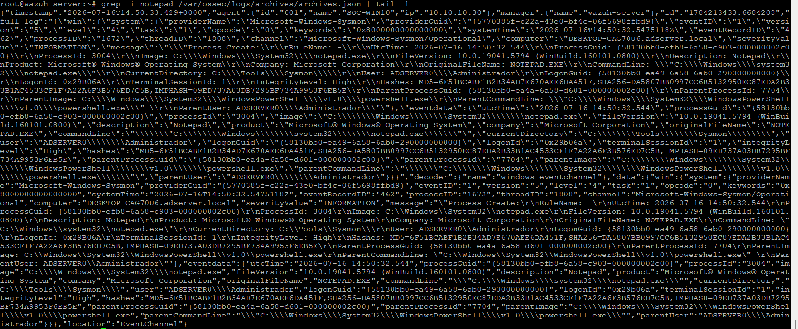

# Sysmon Deployment on the Windows Endpoint

How the Windows 10 endpoint gained process-level telemetry. This is the deliverable of milestone C2-02: Sysmon installed on SOC-WIN10 with a documented configuration, and its events collected, decoded, and correctly attributed in Wazuh.

The reasoning for starting Chapter 2 here is in the [Chapter 2 Scope](./08-chapter-2-scope.md); the agent that carries the new channel was enrolled in the [Wazuh Agent Onboarding](./03-wazuh-agent-onboarding.md). Status is tracked in the [Roadmap](../ROADMAP.md).

## What Sysmon adds

The Windows 10 agent already forwards the native Application, Security, and System channels. What those channels lack is process detail. Sysmon's Event ID 1 records every process creation with the full command line, three file hashes (MD5, SHA256, IMPHASH), the integrity level, and the complete parent lineage. For detection work the parent is the part that matters: a PowerShell spawned by a logged-in user's shell and a PowerShell spawned by a Word document are the same event in the Security log — and two very different stories in Sysmon.

## Configuration

Sysmon without a configuration file logs far too little to detect anything and, fully opened up, far too much to read. The deployment starts from the SwiftOnSecurity community baseline: a single, heavily commented XML whose ProcessCreate section works by exclusion — record everything except a curated list of routine Windows noise. That approach suits a lab that still has to learn what its own noise looks like; tuning against real false positives is C2-06's job.

The exact versions this document describes:

| Component | Version |
|---|---|
| Sysmon | 15.21 |
| Configuration | SwiftOnSecurity `sysmonconfig-export.xml`, rule configuration v4.50, config hash `SHA256=055FEBC600E6D7448CDF3812307275912927A62B1F94D0D933B64B294BC87162` |
| Endpoint | Windows 10 Pro (SOC-WIN10, 10.10.10.30) |
| Wazuh agent / manager | 4.14.6 / 4.14.6 |

Installation is one command in an elevated PowerShell:

```powershell
.\Sysmon64.exe -accepteula -i sysmonconfig-export.xml
```

The `Sysmon64` service came up in **Running** and `Sysmon64.exe -c` printed the active configuration — including the config hash above, which pins precisely which ruleset this deployment runs.

## Local validation

Before involving Wazuh, the endpoint had to prove the telemetry on its own. A `notepad.exe` launched from PowerShell is a controlled, unmistakable process creation; the `Microsoft-Windows-Sysmon/Operational` channel recorded it as Event ID 1 with the full command line, the hashes, and `powershell.exe` as the parent — exactly the fields the detection scenarios will lean on.

## Agent collection

One `<localfile>` block added to `ossec.conf` on SOC-WIN10, alongside the channels the agent already reads:

```xml
<localfile>
  <location>Microsoft-Windows-Sysmon/Operational</location>
  <log_format>eventchannel</log_format>
</localfile>
```

The agent restarted clean and stayed **Active** in the dashboard, with the native channels uninterrupted.

## Verification

The milestone counts as validated when the controlled event is found on the manager, decoded and attributed to the right agent. Getting there ran into a Wazuh default that shapes the rest of the chapter: the manager ships Sysmon rules out of the box (the 61600 group), but the mappings for routine events carry **level 0** — the event is decoded and then dropped, raising no alert and leaving no trace in the dashboard. From the dashboard alone, a healthy Sysmon pipeline and a broken one look identical.

Verification therefore used the manager's archives. With `<logall_json>` temporarily enabled, the controlled event was repeated on SOC-WIN10 and found in `archives.json`, fully decoded; the archives were switched back off afterwards, since full-take retention has no place running permanently on a lab manager.


*The archived event: `providerName Microsoft-Windows-Sysmon`, Event ID 1, `notepad.exe` with `powershell.exe` as parent, attributed to agent SOC-WIN10 (001) through the `windows_eventchannel` decoder.*

| Check | Expected | Observed | Evidence |
|---|---|---|---|
| Local telemetry | Event ID 1 for the controlled process in the Sysmon channel | `notepad.exe` recorded with command line, three hashes, and `powershell.exe` as parent | [02-sysmon-event1-local.png](./img/09-sysmon/02-sysmon-event1-local.png) |
| Agent collection | The agent reads the Sysmon channel and stays Active | Clean restart with the new `<localfile>` block; agent Active, native channels intact | [03-ossec-conf-localfile.png](./img/09-sysmon/03-ossec-conf-localfile.png) |
| Manager identification | The event reaches the manager decoded and attributed | `archives.json` entry with `providerName Microsoft-Windows-Sysmon`, `eventID 1`, agent SOC-WIN10 | [04-wazuh-archives-sysmon.png](./img/09-sysmon/04-wazuh-archives-sysmon.png) |
| Alerting | None — rule 61603 maps Event ID 1 at level 0 | No alert raised, as expected; turning this telemetry into alerts is C2-05 | — |

## Known limitations

- Sysmon runs on the Windows 10 endpoint only, a scope decision made in the [Chapter 2 Scope](./08-chapter-2-scope.md). The domain controller is the natural next candidate once this deployment has been through tuning.
- The default level-0 mappings mean this milestone delivers visibility without detection: the telemetry is collected but raises nothing until C2-05 adds custom rules. Until then the richest data source in the lab is also the quietest.
- The configuration is an untuned community baseline. How much it logs on this particular endpoint — and what its false-positive surface looks like — is measured in the next milestones, not assumed here.
- The endpoint still carries its factory hostname, so the `computer` field in the events (`DESKTOP-*.adserver.local`) does not match the agent name. Wazuh attributes events by agent, so nothing breaks, but the mismatch shows in raw evidence.

## Evidence

Screenshots supporting this document, sanitized before publication:

| File | What it shows |
|---|---|
| `img/09-sysmon/01-sysmon-service-config.png` | The `Sysmon64` service in Running and the active configuration with its hash |
| `img/09-sysmon/02-sysmon-event1-local.png` | The controlled Event ID 1 in the local Sysmon channel, with command line, hashes, and parent |
| `img/09-sysmon/03-ossec-conf-localfile.png` | The `<localfile>` block for the Sysmon channel in the SOC-WIN10 agent configuration |
| `img/09-sysmon/04-wazuh-archives-sysmon.png` | The decoded event in the manager archives, attributed to SOC-WIN10 |
