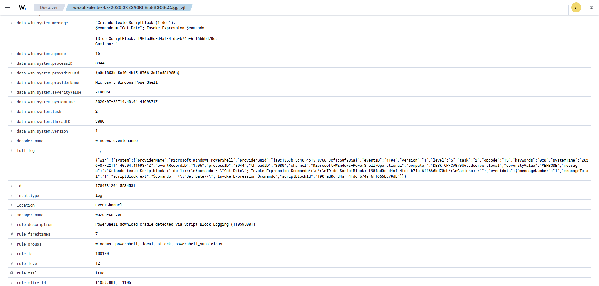
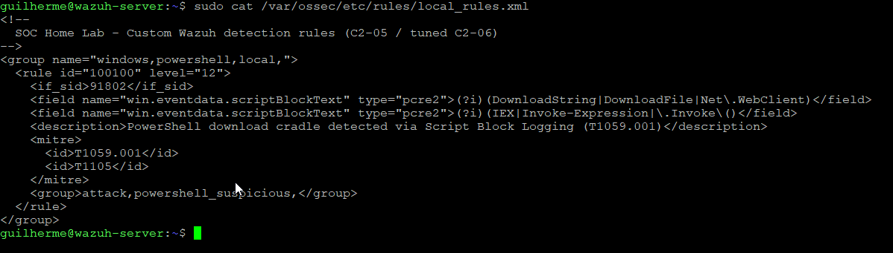
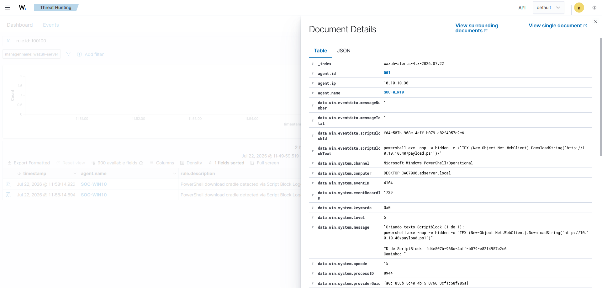

# Rule Tuning: Separating the Cradle from Normal PowerShell

Catching the attack was C2-05's job; being worth keeping is this one's. A rule that also lights up on everyday administration trains an analyst to ignore it, so before the download-cradle rule counts as finished it has to run against ordinary PowerShell and prove it can tell the two apart. This milestone puts it through normal use, finds where it over-fires, and tightens it.

The rule being tuned is documented in the [custom detection rule](./11-custom-detection-rule.md); the endpoint behaviour it runs against was measured in the [baseline](./10-sysmon-baseline.md). Status is tracked in the [Roadmap](../ROADMAP.md).

## The false positive

An hour of normal PowerShell on SOC-WIN10 — a mix of real use and deliberately chosen administrative commands — was measured against the rule. The commands included legitimate uses of the same cmdlets the cradle abuses, so the rule would show its edges rather than stay quiet on a thin sample.

It over-fired, and the clearest case was the plainest kind of legitimate scripting:

```powershell
$comando = "Get-Date"; Invoke-Expression $comando
```

This assigns a command to a variable and runs it — a normal pattern in administrative scripts — with no download anywhere. The original rule matched it on the `Invoke-Expression` marker alone and raised a level-12 alert, indistinguishable in the dashboard list from the real cradle, since the description comes from the rule rather than the script.


*The decoded 4104 event: `scriptBlockText` is `$comando = "Get-Date"; Invoke-Expression $comando` — a benign command execution that nonetheless triggered the cradle rule.*

## What the false positive revealed

The first rule matched any single marker from the cradle's vocabulary — a download method or an execution call. That was too broad. `Invoke-Expression` and `IEX` turn up constantly in legitimate scripts, so matching either on its own is a promise of noise. A download cradle is really two things happening together: it pulls code from somewhere and runs it in memory. The benign `Invoke-Expression $variable` does the second and never the first.

The tuning follows from that. Instead of one condition matching any marker, the rule now carries two conditions on the same field, which Wazuh evaluates as a logical AND — the script block has to contain a download method **and** an execution call:

```xml
<rule id="100100" level="12">
  <if_sid>91802</if_sid>
  <field name="win.eventdata.scriptBlockText" type="pcre2">(?i)(DownloadString|DownloadFile|Net\.WebClient)</field>
  <field name="win.eventdata.scriptBlockText" type="pcre2">(?i)(IEX|Invoke-Expression|\.Invoke\()</field>
  <description>PowerShell download cradle detected via Script Block Logging (T1059.001)</description>
  ...
</rule>
```

The cradle — `IEX (New-Object Net.WebClient).DownloadString(...)` — has both halves and still matches. The `Get-Date` example has execution but no download, so it no longer clears the first condition.


*The rule with two `scriptBlockText` conditions: a download method and an execution call, both required.*

## Verification

A tuning change is only good if it passes two tests that pull in opposite directions — the false positive stops, and the real detection keeps working. Both were run after the change, checked against the alert timeline so a leftover alert from before wouldn't be read as a new one.

| Side | Test | Result |
|---|---|---|
| False positive removed | Re-run `Invoke-Expression $comando` after tuning | No new alert — the benign execution is silent |
| Detection preserved | Re-run the UC-03 cradle after tuning | Alert still fires at level 12 |


*Post-tuning: the download cradle still raises rule 100100 at level 12, attributed to SOC-WIN10, while the benign `Invoke-Expression` no longer appears.*

The rule tells the cradle apart from the ordinary scripting around it. The tuned version is committed to [`detection/local_rules.xml`](../detection/local_rules.xml).

## Known limitations

- The download and execution markers are still literal. An attacker who obfuscates either half — a Base64-encoded command, a reflectively loaded method, string concatenation to hide `DownloadString` — would evade this pair, the same way the earlier version could be evaded. Broader obfuscation coverage is a larger detection-engineering effort than this milestone.
- The benign sample was one hour on one endpoint. A longer window, or an endpoint that runs installers or update scripts using `Net.WebClient` legitimately, could surface a case the current markers still catch — and that would be the next round of tuning, not a failure of this one.
- Requiring both halves narrows the rule to the download-and-execute shape. A cradle that downloads to disk first and executes separately would split across two script blocks and slip between the conditions; catching that is a correlation problem left for later.

## Evidence

Screenshots supporting this document, sanitized before publication:

| File | What it shows |
|---|---|
| `img/12-tuning/01-fp-dashboard-before.png` | Rule 100100 alerts during the benign window, before tuning |
| `img/12-tuning/02-fp-scriptblock-sample.png` | The benign `Invoke-Expression` event that triggered the untuned rule |
| `img/12-tuning/03-rule-tuned.png` | The tuned rule requiring both a download and an execution marker |
| `img/12-tuning/04-after-tuning.png` | After tuning: the cradle still alerts, the false positive is gone |
