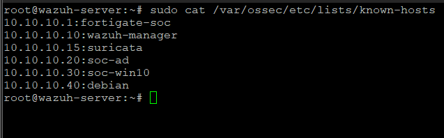
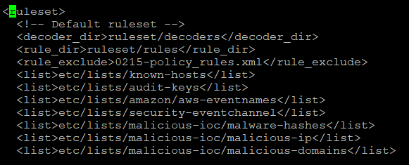
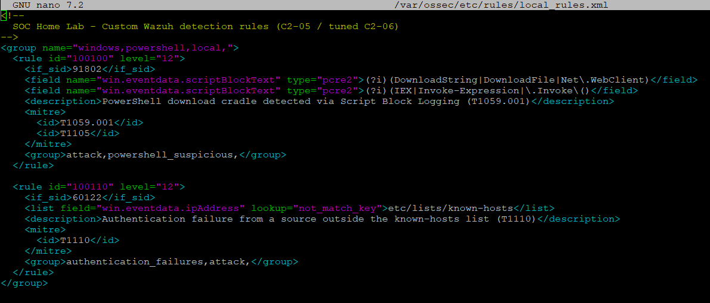
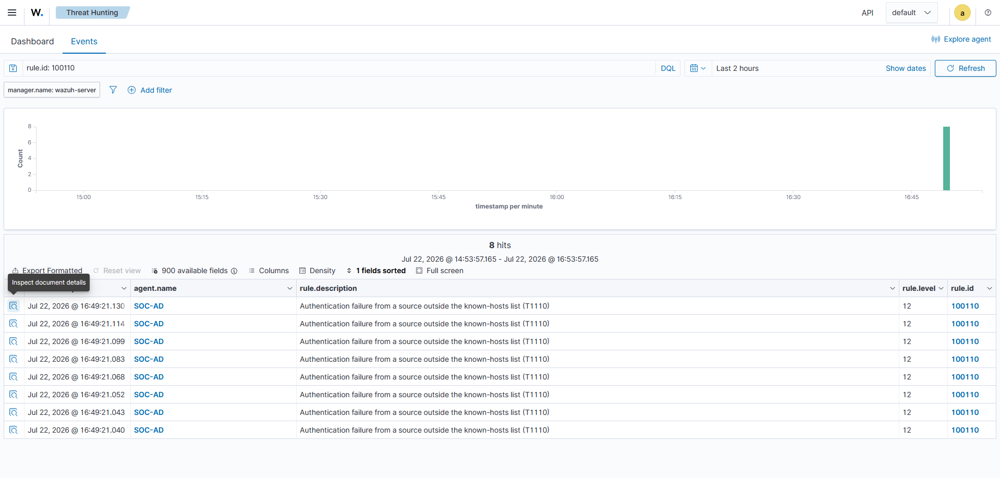
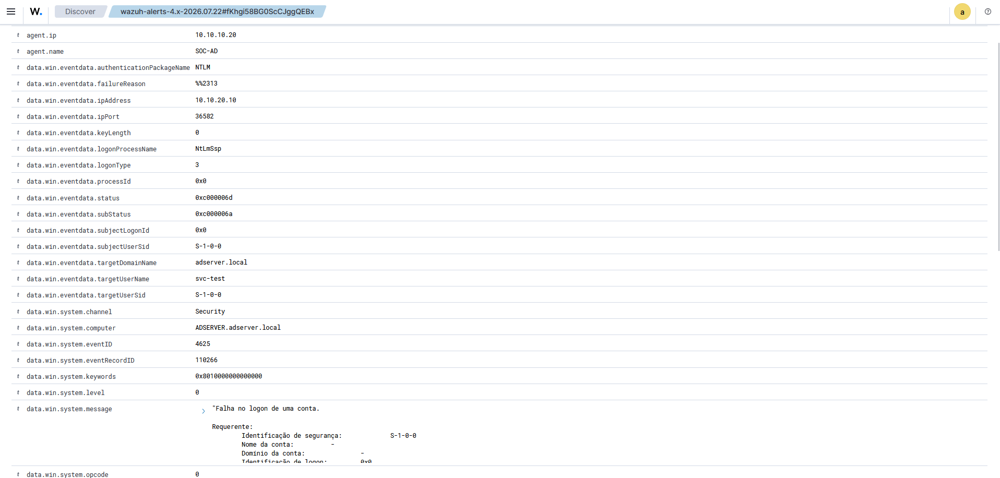
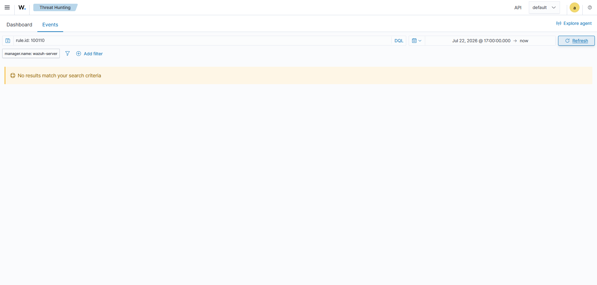
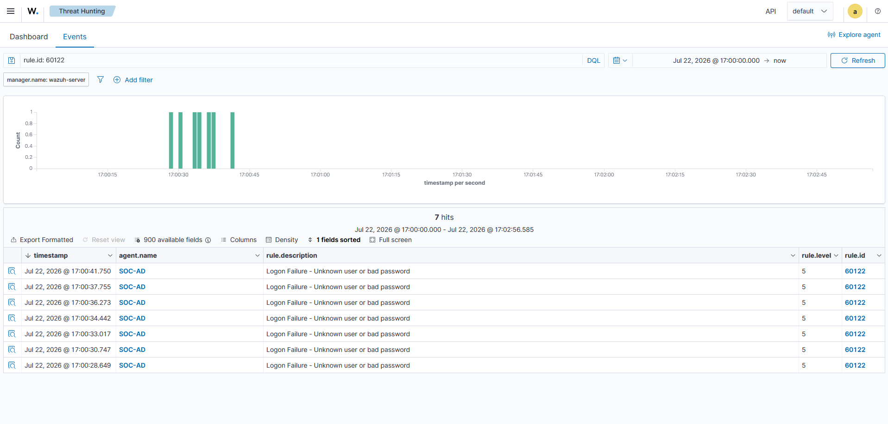
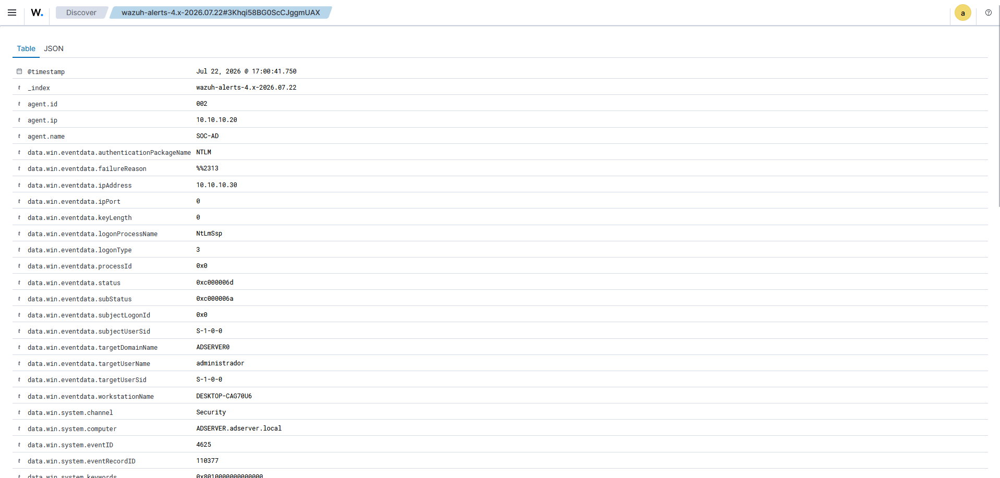

# Alert Enrichment: Weighting Authentication Failures by Source

A failed login from a domain workstation and the same failure from an address that has no business touching the domain controller are not the same event, but Wazuh's built-in rule treats them alike — both land at level 5, side by side. This milestone gives the SIEM a way to tell them apart. A CDB list of known lab hosts, and a rule that reads it, raise an authentication failure to level 12 when its source is not on the list, leaving failures from known hosts at their original weight.

The attack behind this is the UC-02 brute force ([report](../investigations/UC-02/report.md)); the rule builds on Wazuh's stock authentication chain rather than replacing it. This is the first milestone of Chapter 3, whose plan is in the [Scope](./14-chapter-3-scope.md); status is tracked in the [Roadmap](../ROADMAP.md).

## The known-hosts list

Enrichment needs a reference for what "known" means. That reference is a CDB list — a plain key-value file on the manager, one host per line as `IP:name`:

```
10.10.10.1:fortigate-soc
10.10.10.10:wazuh-manager
10.10.10.15:suricata
10.10.10.20:soc-ad
10.10.10.30:soc-win10
10.10.10.40:debian
```


*The list at `/var/ossec/etc/lists/known-hosts`: the SOC-network hosts from the IP plan, keyed by address. Kali (10.10.20.10) is deliberately absent — it is the source the rule is meant to flag.*

The list is registered inside the existing `<ruleset>` block in `ossec.conf`, alongside the built-in lists the manager already loads:

```xml
<list>etc/lists/known-hosts</list>
```


*The `known-hosts` list added to the `<ruleset>` section, so the manager compiles it at startup and rules can query it.*

## The rule

The enrichment rule chains to `60122` — Wazuh's own "Logon Failure - Unknown user or bad password" — and adds a single condition: the source address is not a key in the list.

```xml
<rule id="100110" level="12">
  <if_sid>60122</if_sid>
  <list field="win.eventdata.ipAddress" lookup="not_match_key">etc/lists/known-hosts</list>
  <description>Authentication failure from a source outside the known-hosts list (T1110)</description>
  <mitre>
    <id>T1110</id>
  </mitre>
  <group>authentication_failures,attack,</group>
</rule>
```


*Rule 100110, next to the download-cradle rule 100100 from Chapter 2. Custom rules add to the local file; neither the built-in 60122 nor the existing 100100 is touched.*

`if_sid 60122` means the rule only evaluates events the ruleset has already classified as a logon failure, so it never scans unrelated logs. The `not_match_key` lookup reads `win.eventdata.ipAddress` — the source address the Windows 4625 event carries, confirmed as the populated field on the UC-02 alert — and fires only when that address is missing from the list. A known host clears the lookup and the rule stays silent; an unknown one raises a second, level-12 alert on top of the base failure. The two coexist by design, which is what the tests below check from both sides.

## Verification

The rule has to hold in two opposite cases: it must elevate an unknown source and must leave a known one alone. Both were run against the alert timeline so an alert from the other test could not be misread.

### Unknown source elevates

Re-running the UC-02 brute force from Kali (10.10.20.10, off the list) produced the base failures and, on top of each, the level-12 alert:


*Threat Hunting filtered on `rule.id: 100110`: eight elevated alerts from SOC-AD at level 12, each described as an authentication failure from outside the known-hosts list.*


*The decoded 4625 alert: `ipAddress 10.10.20.10` — Kali, absent from the list — with `eventID 4625` and the target `svc-test`, mapped to T1110.*

### Known source stays at base level

Failed logons generated from SOC-WIN10 (10.10.10.30, on the list) produced only the base rule, and no 100110:


*The same `rule.id: 100110` filter over the Test B window returns nothing — the known source did not elevate.*


*Filtering instead on `rule.id: 60122` shows the seven logon failures at level 5, recorded but not elevated.*


*One of those events expanded: `ipAddress 10.10.10.30` — SOC-WIN10, a key in the list — so the lookup matched and rule 100110 never fired.*

| Check | Expected | Observed | Evidence |
|---|---|---|---|
| Unknown source elevates | The Kali brute force raises rule 100110 at level 12 | Eight level-12 alerts, `ipAddress 10.10.20.10` | [04](./img/15-cdb/04-alert-unknown-dashboard.png), [05](./img/15-cdb/05-alert-unknown-detail.png) |
| Known source does not elevate | Failures from SOC-WIN10 stay at the base level | Only rule 60122 at level 5, no 100110, `ipAddress 10.10.10.30` | [06](./img/15-cdb/06-alert-known-not-elevated.png), [07](./img/15-cdb/07-alert-known-base-only.png), [08](./img/15-cdb/08-alert-known-detail.png) |

The same authentication failure now carries a different severity depending on where it came from — which is the distinction the next milestone builds its response on, so that automated blocking fires on the elevated alert and never on ordinary failed logons.

## Why a list instead of a broader rule

A rule could raise every authentication failure to level 12 and skip the list entirely, but that trades one blindness for another: an analyst who is paged on the domain's normal share of mistyped passwords learns to dismiss the alert. Weighting by source keeps the signal where it belongs. The list answers a question the raw event cannot — is this address one the lab expects to see — and the rule spends its severity only on the answers that warrant it. It also gives Chapter 3 a clean trigger: the response should act on hostile sources, not on a user fumbling a login, and the elevated rule is exactly that boundary.

## Known limitations

The enrichment reads the source address from the 4625 event, so it is only as good as that field. Network logons (type 3), which is how the brute force arrives, carry the real source address; logon types that leave `ipAddress` empty or set to a loopback would not match a list keyed on real addresses, and a failure from such a path would neither match nor be caught as unknown in a useful way.

The list is maintained by hand. A new legitimate host has to be added before its failures stop elevating, and a stale entry would keep trusting an address the lab no longer uses. At lab scale this is a few lines; at any real scale it argues for generating the list from an inventory rather than editing it directly.

The management workstation (192.168.16.65) is not yet on the list. It did not affect these tests, and while enrichment only elevates, an un-listed management source elevating causes no harm. That changes once the elevated alert drives an automated block — a management failure could then be acted on — so the station is added to the list in the Active Response milestone (C3-03), where the list becomes a safeguard rather than a label. The `MGMT-to-SOC` path applies no NAT, so the station registers with its real 192.168.16.65 address and a list entry will match.

Finally, the rule elevates one event family. It reads authentication failures and nothing else; unknown-source activity that is not a logon failure falls outside it. Enrichment here is a severity adjustment on a known detection, not a new detection.

## Evidence

Screenshots supporting this document, sanitized before publication:

| File | What it shows |
|---|---|
| `img/15-cdb/01-known-hosts-list.png` | The known-hosts CDB list on the manager |
| `img/15-cdb/02-ossec-conf-list.png` | The list registered in the `ossec.conf` ruleset |
| `img/15-cdb/03-local-rules-100110.png` | Rule 100110 in `local_rules.xml` |
| `img/15-cdb/04-alert-unknown-dashboard.png` | Rule 100110 firing at level 12 for the Kali brute force |
| `img/15-cdb/05-alert-unknown-detail.png` | The elevated alert, source 10.10.20.10 |
| `img/15-cdb/06-alert-known-not-elevated.png` | No 100110 alerts for the known source |
| `img/15-cdb/07-alert-known-base-only.png` | The known-host failures at base level 5 |
| `img/15-cdb/08-alert-known-detail.png` | A base failure expanded, source 10.10.10.30 |
