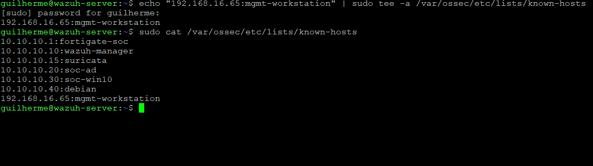
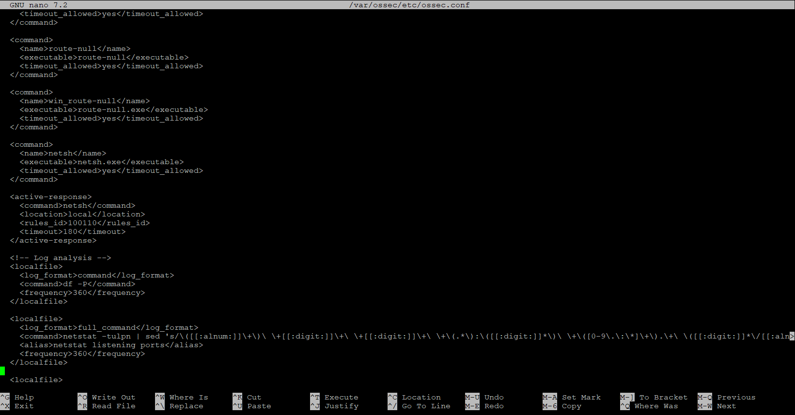
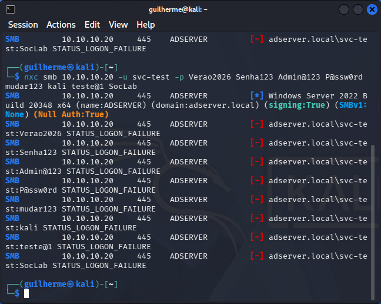
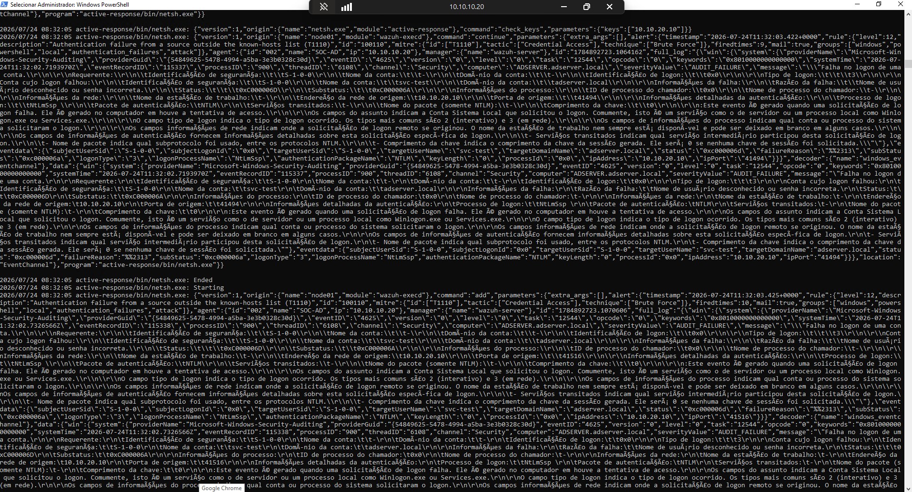
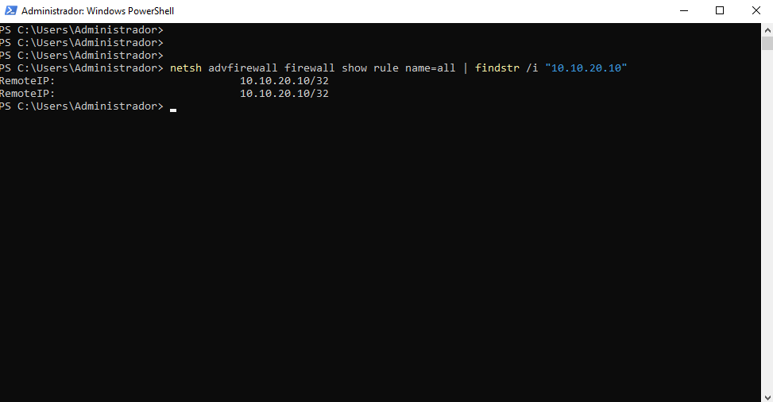
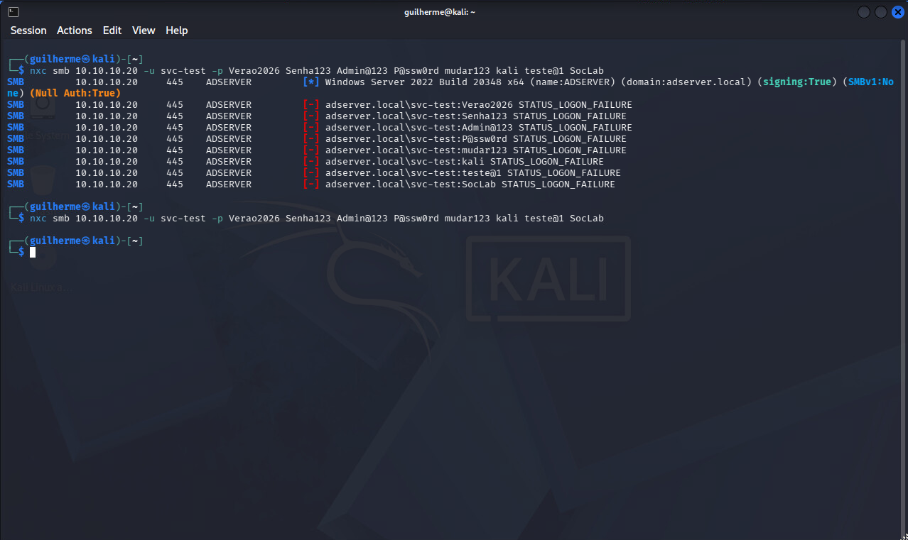
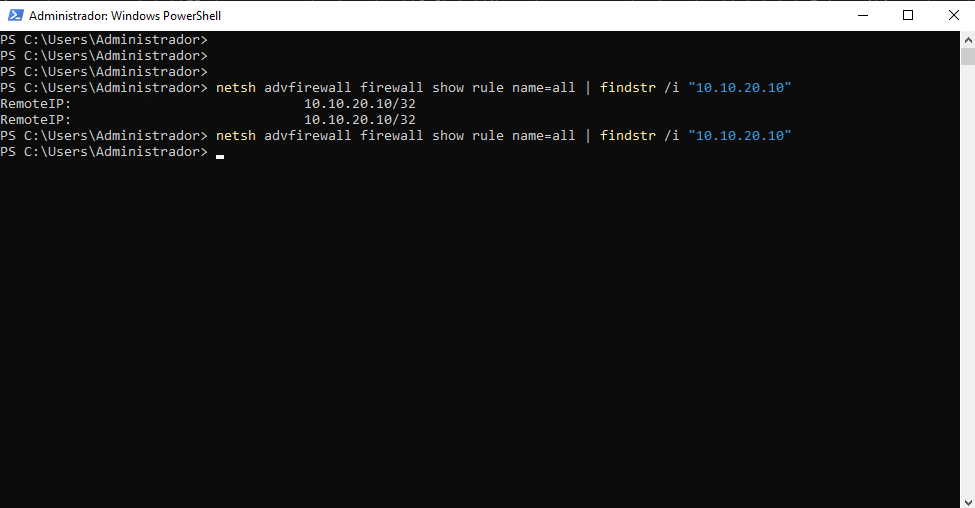
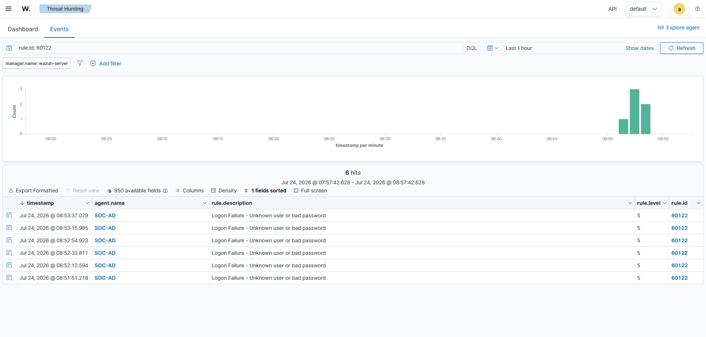
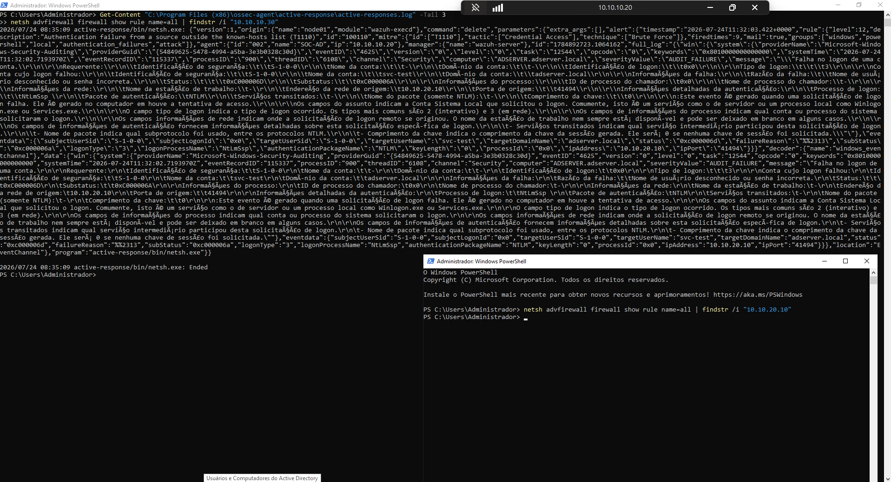

# Active Response: Blocking an Unknown Source on the Domain Controller

In the last milestone an unknown-source brute force became a level-12 alert and then sat there. This one puts that alert to work. When rule 100110 fires, a Wazuh Active Response writes a Windows Firewall rule on the domain controller that drops the source address, then clears it again once a timeout expires. The block stays narrow — one address, on the host under attack — and since it lifts itself, a mistaken block clears before it can do real damage.

The rule that triggers this is the [CDB enrichment rule](./15-cdb-enrichment.md); the attack it responds to is the UC-02 brute force ([report](../investigations/UC-02/report.md)). This is milestone C3-03; the chapter plan is in the [Scope](./14-chapter-3-scope.md) and status in the [Roadmap](../ROADMAP.md).

## The safeguard comes first

Before arming anything that blocks on its own, the management workstation had to go onto the known-hosts list. Enrichment could get away without it — an unlisted management host would just raise a louder alert, no harm done. Once a block is in the picture the stakes change, because a stray failed logon from that host would now lock it out of the domain. Since the `MGMT-to-SOC` path runs without NAT, the workstation shows up at the DC as 192.168.16.65, and the list entry matches that address directly.

```
192.168.16.65:mgmt-workstation
```


*The known-hosts list with the management workstation appended. A failed logon from this address now stops at the base rule and never reaches the response.*

## The response configuration

Two blocks in the manager's `ossec.conf` define the response. The first names the command and the executable that runs it; the second ties that command to a trigger, a location, and a lifetime.

```xml
<command>
  <name>netsh</name>
  <executable>netsh.exe</executable>
  <timeout_allowed>yes</timeout_allowed>
</command>

<active-response>
  <command>netsh</command>
  <location>local</location>
  <rules_id>100110</rules_id>
  <timeout>180</timeout>
</active-response>
```


*The `netsh` command and the active-response that fires it — bound to rule 100110, run on the agent that raised the alert, block lifted after 180 seconds.*

The choice of `rules_id 100110` is what keeps the response safe. It hangs off the enriched rule rather than the base authentication failure, so an everyday mistyped password — which stops at rule 60122 — never reaches it. `location local` sends the block to whichever agent raised the alert; because 100110 fires on SOC-AD's events, that agent is the domain controller. The `timeout` settings take care of the cleanup — with `timeout_allowed` on the command and 180 seconds on the response, whatever writes the firewall rule also pulls it back out.

One risk the scope raised did not materialise. It worried the source address might live only in `win.eventdata.ipAddress`, with no top-level `srcip` for the stock response to read, which would have meant building a decoder bridge or a custom script. The `netsh.exe` script pulled `10.10.20.10` out of the alert on its own — the value shows up in its `check_keys` call — so none of that was necessary.

## The response cycle

One controlled run of the UC-02 brute force from Kali walked through the whole cycle, from the alert that starts it to the block that clears itself three minutes later.

### Trigger

The brute force reaches the domain controller and fails on credentials — eight password attempts, each an authentication failure, each raising rule 100110:


*`nxc` against SOC-AD: every attempt returns `STATUS_LOGON_FAILURE`, meaning the connection reached authentication and was rejected on the password. These are the events that fire the enriched rule.*

### Block

On the agent, the response proceeds and completes. The log shows the protocol: the script asks whether the address is already handled (`check_keys`), the manager answers `continue`, and the firewall rule goes on:


*The agent's `active-responses.log`: `check_keys` for 10.10.20.10, a `continue` from the manager, and `Ended` — the block applied.*

The rule is now live in the domain controller's firewall:


*`netsh advfirewall firewall show rule` filtered on the address: an inbound rule with `RemoteIP 10.10.20.10/32`, dropping the attacker's traffic.*

### Containment

With the block in place, the same brute force run again cannot get through. The attacker's packets are dropped before they reach the SMB service, so the tool that reached authentication a moment ago now returns nothing at all:


*The same `nxc` command, twice. The first run enumerates the host and reaches authentication; the second, during the active block, produces no output at all — no banner, no failure lines — because the connection never lands.*

### Reversal

No one removes the block. After the 180-second timeout the response deletes the rule and the domain controller stops dropping the address:


*The same firewall query, before and after: `RemoteIP 10.10.20.10/32` present while the block holds, and an empty result once the timeout lifts it.*

## The safeguard, tested

The response would be a liability if it also fired on everyday failures, so that case was checked directly. Failed logons generated from SOC-WIN10, a host already on the known-hosts list, showed up as ordinary base-rule events. The enriched rule stayed quiet, and the response was never called.


*Six logon failures from SOC-AD at level 5 — the known-source failures, seen and recorded, but stopped at rule 60122.*


*The agent's response log after the known-source failures: its last action is the earlier timeout removal, with nothing new. No 100110, no block — the response is silent for an address on the list.*

| Check | Expected | Observed | Evidence |
|---|---|---|---|
| Response triggers on the enriched rule | The unknown-source brute force blocks 10.10.20.10 on the DC | `continue` then `Ended`, firewall rule with `RemoteIP 10.10.20.10/32` | [04](./img/16-response/04-ar-block-action.png), [05](./img/16-response/05-firewall-block-active.png) |
| The block contains a live attempt | A second attack during the block is refused | Same `nxc` command returns no output — connection dropped | [06](./img/16-response/06-kali-brute-blocked.png) |
| The block reverses on its own | The rule is gone after the 180s timeout | Firewall query empty after the timeout | [07](./img/16-response/07-firewall-block-removed.png) |
| Known source does not trigger the response | Failures from a listed host raise no block | Rule 60122 only, no 100110, no response action | [08](./img/16-response/08-known-source-no-response.png), [09](./img/16-response/09-known-source-base-only.png) |

## What the test revealed

The response worked, and in working it exposed two behaviours that are easy to miss.

First, the block catches the following attempt rather than the one that set it off. `nxc` fires all eight passwords in under a second, while the block has to travel a full loop before it exists: the event reaches the manager, the rule evaluates, the response goes back down to the agent, and only then does the firewall rule get written. That loop takes longer than the burst, so the triggering attempts have already finished by the time the address is dropped. What the containment shot captures is the second run hitting a block the first run put in place. For a drawn-out or repeated attack the timing is fine; for one quick burst the response lands a step behind.

Second, the response does not pile up on itself. Rule 100110 fired eight times, so the response ran eight times, yet only the first one blocked anything. The rest each ran `check_keys`, found the address already handled, and stopped. Where there could have been eight stacked firewall rules and eight overlapping timeouts, there was one of each. The burst is what made this dedup visible; the response safeguards milestone (C3-05) returns to it with its own evidence.

## Known limitations

The block sits on the domain controller's own firewall, so it only keeps the attacker off that single host. The FortiGate keeps routing the traffic as before; blocking at the firewall would contain more, and that is work for a later step.

The reaction latency above means a single fast burst runs to completion before the block arrives. Stopping the first attempt would take inline blocking rather than an alert-driven response, which is not something this lab has.

Everything hinges on one field in one kind of event — the source address of an authentication failure. An attack that never produces a 4625, or arrives through a logon type that leaves `ipAddress` empty, gives the response nothing to act on. Its reach ends where the enriched rule's does.

The block also works purely by source address, so an attacker who switches addresses simply comes back as another unknown source and gets blocked again — nothing here prevents the move itself. Any address wrongly left on the trusted list, meanwhile, is never blocked at all. The list is maintained by hand, and the response trusts it completely.

## Evidence

Screenshots supporting this document, sanitized before publication:

| File | What it shows |
|---|---|
| `img/16-response/01-known-hosts-updated.png` | The management workstation added to the known-hosts list |
| `img/16-response/02-ossec-conf-ar.png` | The command and active-response blocks in `ossec.conf` |
| `img/16-response/03-kali-brute-trigger.png` | The Kali brute force reaching authentication |
| `img/16-response/04-ar-block-action.png` | The response executing the block, and aborting on duplicates |
| `img/16-response/05-firewall-block-active.png` | The block present in the DC's Windows Firewall |
| `img/16-response/06-kali-brute-blocked.png` | A second attack refused during the active block |
| `img/16-response/07-firewall-block-removed.png` | The block removed after the timeout |
| `img/16-response/08-known-source-no-response.png` | No response action for a known source |
| `img/16-response/09-known-source-base-only.png` | The known-source failures stopped at the base rule |
