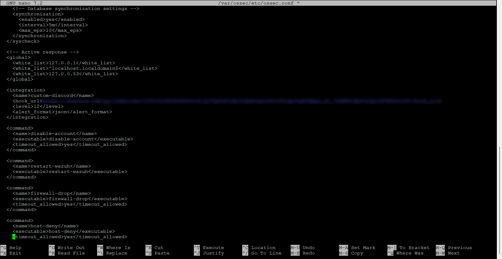
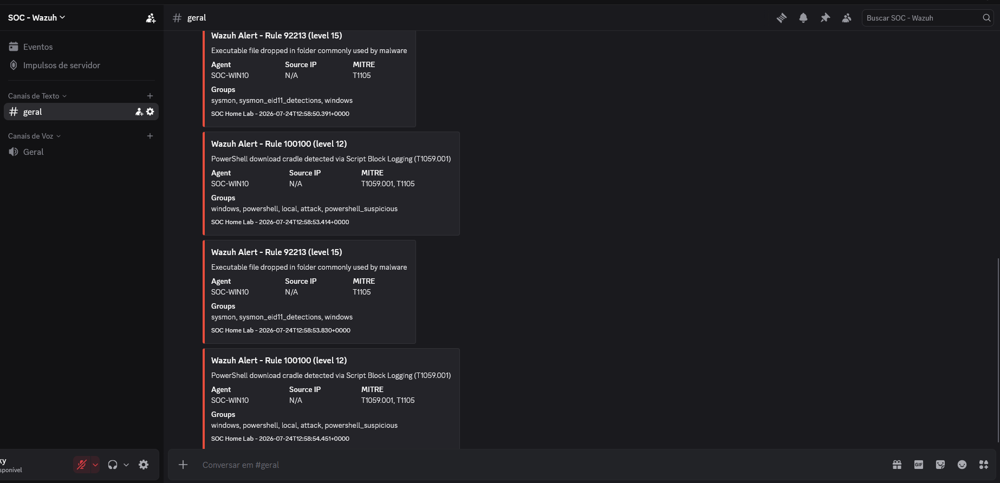
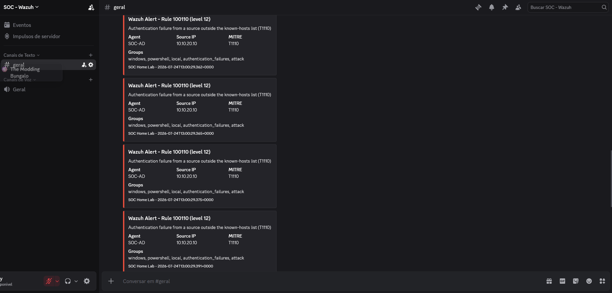

# Discord Notifications: High-Severity Alerts Out of the Dashboard

So far the chapter has kept everything inside Wazuh. This milestone adds a way to find out about a high-severity alert without sitting on the dashboard: a custom integration that forwards every level-12-and-above alert to a Discord channel through a webhook.

The alerts it carries come from the two detection chains built earlier: the [download-cradle rule](./11-custom-detection-rule.md) and the [enriched authentication rule](./15-cdb-enrichment.md). This is milestone C3-04; the chapter plan is in the [Scope](./14-chapter-3-scope.md) and status in the [Roadmap](../ROADMAP.md).

## The integration

Discord has no native integration in Wazuh the way Slack does, so this one is custom. Two files in `/var/ossec/integrations/` make it up. A short shell wrapper runs the logic with the manager's bundled Python; the Python script reads the alert, builds a Discord embed, and posts it to the webhook. Both are committed at [`integrations/`](../integrations/), and neither holds the webhook URL — the manager passes that in at call time.

The manager side is one block in `ossec.conf`:

```xml
<integration>
  <name>custom-discord</name>
  <hook_url>REDACTED</hook_url>
  <level>12</level>
  <alert_format>json</alert_format>
</integration>
```


*The `custom-discord` integration, filtering on level 12 and writing the alert as JSON. The `hook_url` holds the Discord webhook and is redacted here — it is a write credential to the channel and never enters the repository.*

The `<level>12</level>` line decides which alerts go out, and it decides on severity alone. Every alert at level 12 or higher reaches Discord — both custom rules sit at level 12 — and so does any built-in rule at that level or above. `alert_format json` hands the script the full alert as a structured file, which is what the field extraction below relies on.

## What the script sends

The script pulls a handful of fields from the alert — rule id, level, description, agent, source address, MITRE technique, and groups — and lays them out as a Discord embed, coloured red for level 12 and above. The source address comes from `srcip` when present and falls back to `win.eventdata.ipAddress`, the field the Windows authentication events carry, so an auth-failure alert arrives with the attacker's address already filled in.

## Verification

Both detection chains were run against the live integration, and each produced its message in the channel.

The download cradle raised its rule and a notification followed:


*Rule 100100 in the channel — the PowerShell download cradle on SOC-WIN10, mapped to T1059.001 and T1105. The same cradle also tripped built-in rule 92213 at level 15 (an executable dropped in a suspicious folder); both cleared the level-12 filter, which is the severity threshold at work rather than a rule list.*

The brute force raised the enriched rule, with the source address carried through:


*Rule 100110 from SOC-AD, each message naming the unknown source 10.10.20.10 and the T1110 technique. The burst produced one message per alert — the volume point discussed below.*

| Check | Expected | Observed | Evidence |
|---|---|---|---|
| The integration loads | The manager starts with `custom-discord` active, no error | Integration block in place, no integrator error | [01](./img/17-discord/01-integration-config.png) |
| The cradle chain notifies | Rule 100100 produces a Discord message | Message with the cradle description and ATT&CK IDs | [02](./img/17-discord/02-notification-cradle.png) |
| The auth chain notifies, with source | Rule 100110 produces a message naming the source | Message with 10.10.20.10 and T1110 | [03](./img/17-discord/03-notification-brute-force.png) |

## Getting it to send

The integration failed silently on the first attempt — the alert fired, the script ran, and nothing reached Discord. Two problems sat behind it, and finding them meant taking the send apart.

The first was TLS. The manager's system `curl` reached Discord fine, but the bundled Python did not: it raised `CERTIFICATE_VERIFY_FAILED`, unable to find a local issuer. Wazuh's embedded interpreter does not trust the system CA store the way the OS tools do. Pointing it at the system bundle explicitly — `/etc/ssl/certs/ca-certificates.crt`, the same store `curl` uses — cleared the handshake.

The second surfaced only once TLS worked: an HTTP 403 from Discord. The webhook was valid, but the request looked wrong to the Cloudflare front that Discord sits behind, which rejects the default `Python-urllib` user agent. Setting a plain custom user agent on the request got it through.

Neither fix was more than a line or two, but the script made them hard to find. Its original error handling caught the exception and exited without a word, so a working `curl` sat right next to a failing integration with nothing to explain the difference. It now prints the failure to stderr, which the integrator writes to the log, so the next problem says what it is.

## Known limitations

Notifications carry no deduplication, unlike the Active Response. Rule 100110 firing eight times sends eight messages, and the brute-force screenshot shows them stacked up. The lab shrugs that off; anywhere with real alert volume, the integration would need rate limiting or aggregation before it stayed usable. That missing throttle is the milestone's roughest edge.

Because the filter keys on severity, the channel gets every level-12-and-above alert, the two custom rules included but not alone. Rule 92213 turning up beside the cradle is a mild example; a noisier environment would surface far more, and quieting it down means filtering on specific rule IDs instead of a level.

The webhook URL can post to the channel, so it counts as a credential. It stays in `ossec.conf` on the manager and nowhere else — not the repository, not a screenshot — and if it ever leaks, the fix is to delete it and generate a new one. The channel it writes to is private to the lab.

Delivery hangs on the manager reaching `discord.com`. The SOC network allows that now, but this is the one part of the chapter that has to leave the network to do its job; detection and response run entirely on the manager and its agents. If that egress fails, the alert still lands in Wazuh — the message just never goes out.

## Evidence

Screenshots supporting this document, sanitized before publication:

| File | What it shows |
|---|---|
| `img/17-discord/01-integration-config.png` | The `custom-discord` integration block in `ossec.conf`, webhook redacted |
| `img/17-discord/02-notification-cradle.png` | The rule 100100 cradle alert delivered to Discord |
| `img/17-discord/03-notification-brute-force.png` | The rule 100110 auth-failure alerts, source address included |
