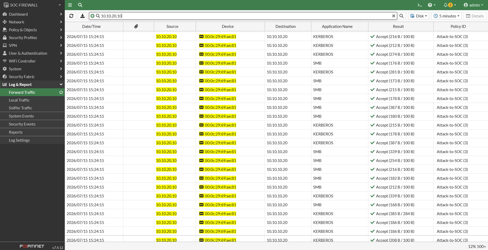
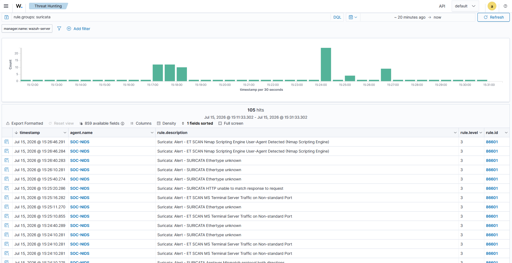
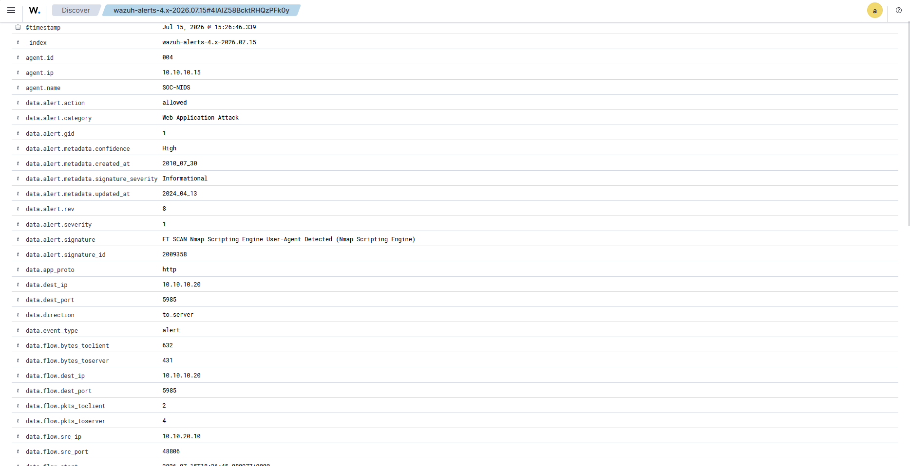

# UC-01: Network Discovery from Kali

The first investigation scenario of Chapter 1. A controlled network scan is launched from the Attack Network, and the goal is to follow that single activity through every layer of the monitoring stack — firewall, network sensor, and SIEM — and confirm it is visible and traceable end to end.

This is the deliverable of milestone C1-08. The telemetry sources it exercises were built and validated earlier: the [FortiGate segmentation](../../docs/02-fortigate-segmentation.md), the [Suricata sensor](../../docs/05-suricata-sensor.md), and the [Suricata–Wazuh integration](../../docs/06-suricata-wazuh-integration.md). Status is tracked in the [Roadmap](../../ROADMAP.md).

## Summary

| Field | Detail |
|---|---|
| Scenario | UC-01 — Network discovery |
| Source | Kali Linux (10.10.20.10, Attack Network) |
| Targets | Active Directory, Windows 10, Debian (SOC Network) |
| Activity | `nmap -sV` service and version scan |
| MITRE ATT&CK | [T1046 — Network Service Discovery](https://attack.mitre.org/techniques/T1046/) |
| Telemetry | FortiGate, Suricata, Wazuh |
| Outcome | Scan visible and correlated end to end; the detections sat at informational level, below where a SOC would act |

The report follows a STAR structure: Situation, Task, Action, Result.

## Situation

The lab is fully instrumented and the monitoring pipeline is validated end to end. What has not been tested is whether a single piece of attacker activity actually surfaces across the stack the way the design promises — each source was proven in isolation, not as a chain.

Network discovery is the natural first scenario: it is what an attacker does early, it is noisy by nature, and it crosses the one boundary the whole lab is built around. It maps to MITRE ATT&CK [T1046 (Network Service Discovery)](https://attack.mitre.org/techniques/T1046/) — enumerating the services a host exposes to find a way in. Kali Linux (10.10.20.10) sits on the isolated Attack Network; its only route to the SOC Network is through the FortiGate under the `Attack-to-SOC` policy, which allows the traffic on purpose so it can be seen rather than blocked.

## Task

Confirm that a controlled scan from Kali against SOC hosts is visible and correlatable across all three telemetry sources:

- the **FortiGate** logs the traffic crossing the boundary, with the real source address preserved;
- **Suricata** detects the scan by signature and the events reach Wazuh through the SOC-NIDS agent;
- **Wazuh** holds the decoded event, letting an analyst tie the network detection back to the same source seen at the firewall.

The scenario succeeds if the same activity can be traced from the firewall log to the network alert without gaps in attribution.

## Action

A service and version scan was launched from Kali against three SOC hosts:

```
nmap -sV 10.10.10.20 10.10.10.30 10.10.10.40
```

The `-sV` flag probes each open port for the service and version behind it, which is deliberately loud — it opens many connections and sends application-layer requests that intrusion signatures are built to catch. The targets were Active Directory (10.10.10.20), Windows 10 (10.10.10.30), and Debian (10.10.10.40).

All three hosts responded. Active Directory answered with a broad Windows service surface — LDAP, Kerberos, SMB, RPC, and WinRM among them; Windows 10 exposed RPC, NetBIOS, SMB, and RDP; and Debian exposed SSH.

Each telemetry source was then queried for the scan's source address, 10.10.20.10.

### FortiGate

Forward Traffic, filtered on source 10.10.20.10, shows the scan crossing the boundary: a burst of sessions to 10.10.10.20 accepted by `Attack-to-SOC (3)`, carrying KERBEROS and SMB among other services. Because NAT is disabled on that policy, the log records the real Kali address (10.10.20.10) rather than the firewall's — the attribution the rest of the investigation depends on.


*Scan sessions from 10.10.20.10 to the Active Directory host, accepted by the Attack-to-SOC policy with the source address preserved.*

### Suricata and Wazuh

Filtering Threat Hunting on `rule.groups: suricata` over the scan window returns the network detections, all attributed to the SOC-NIDS agent. Among the stream-engine noise are the signatures that matter — `ET SCAN Nmap Scripting Engine User-Agent Detected` and `ET SCAN MS Terminal Server Traffic on Non-standard Port` — the sensor recognizing the scan for what it is.


*ET SCAN signatures from the scan, attributed to SOC-NIDS in the Wazuh Threat Hunting view.*

Opening one of those alerts closes the loop. The decoded event carries the scan's source (10.10.20.10), the Active Directory target (10.10.10.20), and the Nmap signature, all in one record:


*The expanded alert: the ET SCAN signature (2009358) with the Kali source and Active Directory destination decoded from `eve.json`.*

The raw event carries the detail that names the tool outright. Suricata captured the flow on `in_iface: ens192` — the passive interface from C1-06, confirming the alert came through the monitoring path and not from traffic addressed to the sensor. The HTTP request behind the alert was a `GET /HNAP1` carrying the user agent `Mozilla/5.0 (compatible; Nmap Scripting Engine; https://nmap.org/book/nse.html)`, which Active Directory answered with a 404. The scan probing a router-management endpoint and announcing itself in the user-agent string is the tool's fingerprint left directly in the telemetry.

## Result

The scan is traceable end to end. The same source and destination appear at the firewall and in the network alert, and the decoded Wazuh event ties them together: 10.10.20.10 scanning 10.10.10.20, accepted at the boundary by design and detected on the wire by signature. The scenario's objective is met — attacker discovery activity crossing the Attack-to-SOC boundary is visible and correlatable across FortiGate, Suricata, and Wazuh.

But visible is not the same as actionable, and the distinction matters. Every detection the scan produced landed at `rule.level 3` with an `Informational` signature severity — below the threshold where a SOC would page anyone. A full reconnaissance sweep crossed the boundary, hit the domain controller, and was recorded accurately, yet nothing in that chain would have pulled an analyst's attention on its own. The data was trustworthy; it just sat under the line where action begins. Turning this kind of low-level, high-context telemetry into an alert worth waking someone for is detection-engineering work, and it belongs to the next chapter — but the gap is worth naming here, because it is the real answer to "would we have caught this?"

The signal was also buried. Of roughly 105 Suricata events the scan produced, only a handful were the ET SCAN signatures that actually name the activity; the rest was stream-engine noise from capturing inside a virtual switch, as documented in the [integration milestone](../../docs/06-suricata-wazuh-integration.md). The meaningful detections were there, but an analyst had to dig for them.

None of this undermines the result: the detection chain held, and the activity was attributable from firewall to SIEM by source and signature. These are the edges of what the scenario proves — the telemetry is trustworthy and complete; turning it into an alert worth acting on is the work that follows.

## Evidence

Screenshots supporting this investigation, sanitized before publication:

| File | What it shows |
|---|---|
| `evidence/01-nmap-output.png` | The scan command and results on Kali — services enumerated on Active Directory, Windows 10, and Debian |
| `evidence/02-fortigate-scan-traffic.png` | Forward Traffic: scan sessions from 10.10.20.10 accepted by Attack-to-SOC, source address preserved |
| `evidence/03-suricata-scan-alerts.png` | ET SCAN signatures from the scan, attributed to SOC-NIDS in Threat Hunting |
| `evidence/04-wazuh-alert-detail.png` | The decoded scan alert with the Kali source, Active Directory destination, and Nmap signature |
