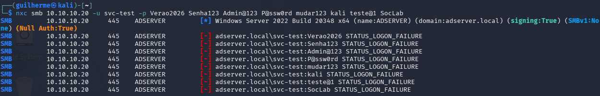
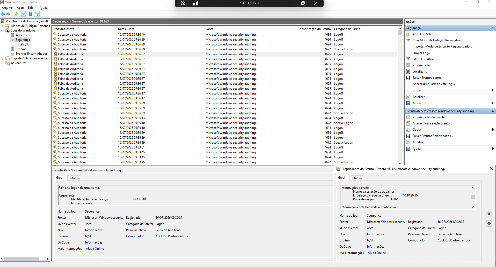
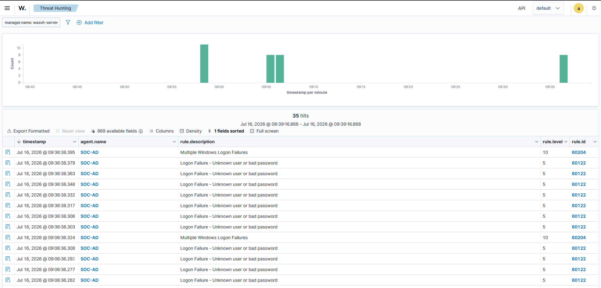
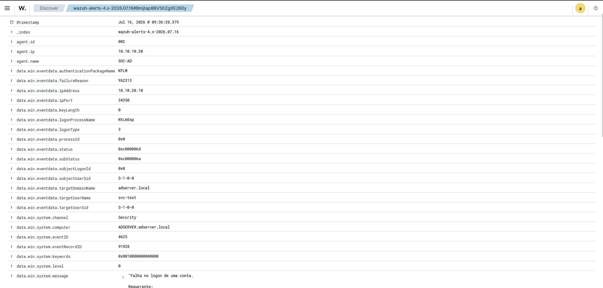

# UC-02: Authentication Failures Against Active Directory

The second investigation scenario of Chapter 1, and the natural next move for an attacker. Having enumerated the services Active Directory exposes in [UC-01](../UC-01/report.md), the next step is to try the doors — guessing credentials against one of them. This scenario follows a controlled password-guessing attack from the native Windows event it produces all the way to the alert it raises in Wazuh.

This is the deliverable of milestone C1-09. The agent that carries the evidence was enrolled in the [Wazuh Agent Onboarding](../../docs/03-wazuh-agent-onboarding.md); status is tracked in the [Roadmap](../../ROADMAP.md).

## Summary

| Field | Detail |
|---|---|
| Scenario | UC-02 — Authentication failures (brute force) |
| Source | Kali Linux (10.10.20.10, Attack Network) |
| Target | Active Directory (10.10.10.20), account `svc-test` |
| Activity | SMB password guessing with netexec — eight wrong passwords against one account |
| MITRE ATT&CK | [T1110.001 — Brute Force: Password Guessing](https://attack.mitre.org/techniques/T1110/001/) |
| Telemetry | Windows Security (native), Wazuh (via the SOC-AD agent) |
| Outcome | Failures collected as Event ID 4625 and escalated by correlation into a level-10 alert — crossing the actionable threshold that UC-01 did not |

The report follows a STAR structure: Situation, Task, Action, Result.

## Situation

The endpoints report to Wazuh and their telemetry is flowing. UC-01 proved that reconnaissance crossing the Attack-to-SOC boundary is visible; the question now is whether an actual attempt to authenticate — the step that turns reconnaissance into intrusion — is not just visible but loud enough to act on.

Active Directory is the target that matters: it holds the identities the rest of the lab trusts. A dedicated throwaway account, `svc-test`, was created on the domain before the test, so any lockout from repeated failures would land on a disposable account rather than a real one. Kali (10.10.20.10) reaches the domain controller over SMB through the same `Attack-to-SOC` policy used in UC-01.

## Task

Confirm that repeated authentication failures against Active Directory are:

- recorded natively by Windows as Security Event ID 4625, with the attacker's source address and the targeted account;
- collected by Wazuh through the SOC-AD agent and available for investigation;
- escalated by correlation into a single alert an analyst would actually act on, rather than staying as scattered low-level events.

The scenario succeeds if one attacker action can be traced from the tool that produced it to the alert that names it.

## Action

The attack was a password-guessing run from Kali against the `svc-test` account over SMB:

```
nxc smb 10.10.10.20 -u svc-test -p Verao2026 Senha123 Admin@123 P@ssw0rd mudar123 kali teste@1 SocLab
```

Eight passwords against a single known account is password *guessing* rather than spraying — the T1110.001 pattern. netexec reported each attempt as a refused SMB login (`STATUS_LOGON_FAILURE`), confirming the account was not compromised.


*Eight SMB authentication attempts against `svc-test`, each refused.*

### Native Windows event

On the domain controller, the Security log recorded a matching Event ID 4625 for every attempt — an audit failure under the Logon category. The events carry the attacker's real address (`10.10.20.10`) as the source network address and Logon Type 3, the network logon SMB uses.


*The DC Security log: a burst of 4625 audit failures from source 10.10.20.10, alongside the normal 4624/4634 logon activity.*

### Collection and correlation in Wazuh

The SOC-AD agent forwards the Security channel to the manager, where the failures surface in Threat Hunting attributed to the agent. Two things happen at once: each 4625 raises rule 60122, *Logon Failure - Unknown user or bad password*, at level 5; and the repetition trips rule 60204, *Multiple Windows Logon Failures*, at level 10 — the correlation that turns a run of individual failures into one alert.


*Threat Hunting: the individual 60122 failures (level 5) from SOC-AD, capped by the 60204 correlation alert (level 10).*

Opening a single event decodes the whole attempt. The record names the targeted account, the attacker's source, and the reason the logon failed:


*The expanded 4625: `targetUserName: svc-test`, `ipAddress: 10.10.20.10`, `logonType: 3`, NTLM, and `subStatus: 0xc000006a` — a valid account met with a wrong password.*

The sub-status is the telling field. `0xC000006A` means the account exists and the password was wrong, distinct from `0xC0000064` (no such user). It confirms the attempt landed on a real account — and, honestly, that it landed there because the account name was handed to the attacker in the test; a real adversary would have to discover or guess the username first, which is itself a hurdle this scenario skips.

## Result

The attempt is traceable end to end. The same target account and attacker source tie the native Windows event to the Wazuh record: `svc-test` under attack from `10.10.20.10`, refused at the domain controller and collected by the SOC-AD agent.

The result worth dwelling on is the contrast with UC-01. The network scan there was visible but never rose above `Informational` — every detection sat at level 3, below where anyone would be paged. This attack behaved the opposite way. The individual failures still arrive quiet, at level 5, but their repetition is exactly what Wazuh's correlation is built to catch, and rule 60204 fires at level 10. Reconnaissance slipped under the waterline; the credential attack broke the surface. Run together, the two scenarios trace the shape of the lab's visibility: not everything that is *seen* is *alerted*, and the difference is correlation — present here, absent for the scan.

That correlation is the whole mechanism. A single failed logon is indistinguishable from a fat-fingered password and should stay quiet; eight in seconds against one account is an attack, and the rule that counts them is what makes it actionable. This is the piece UC-01 was missing, and it is why brute force is a cleaner first alert than reconnaissance for most SOCs.

One extension was left on the table: with eight attempts, a domain lockout policy could have locked `svc-test` and produced an Event ID 4740, which would show the defensive side effect of the attack. No lockout was captured here; the account's disposable status is what made the risk acceptable to ignore.

## Evidence

Screenshots supporting this investigation, sanitized before publication:

| File | What it shows |
|---|---|
| `evidence/01-nxc-bruteforce.png` | The netexec run on Kali — eight SMB attempts against `svc-test`, all refused |
| `evidence/02-windows-4625.png` | The DC Security log with the 4625 audit failures from source 10.10.20.10 |
| `evidence/03-wazuh-auth-failures.png` | Threat Hunting: the level-5 individual failures and the level-10 correlation alert, attributed to SOC-AD |
| `evidence/04-wazuh-alert-detail.png` | The decoded 4625 with the target account, attacker source, and bad-password sub-status |
